# The Skill Trajectory for Working with AI Agents

I've been saying this in Reddit comments for weeks: if you're a professional software engineer, you need to understand the trajectory of agentic development and how it leads to harness engineering.

Fran Soto at Amazon wrote an [excellent piece](https://strategizeyourcareer.com/p/harness-engineering-ai-agents) laying out this progression. I want to build on her framework because understanding where you are on this trajectory is the most important thing you can do right now.

## The Trajectory

Five levels (zero through four). Each one includes everything below it.

```mermaid
sequenceDiagram
    participant User
    participant Agent as Agent
    participant Skills as Skills & Knowledge
    participant Harness as Guardrails & Tools
    participant Platform as Environment

    rect rgb(80, 80, 160)
        rect rgb(70, 70, 140)
            rect rgb(50, 50, 100)
                rect rgb(40, 40, 80)
                User->>Agent: "Build me a signup form"
                Note over User,Agent: 1. Prompt Engineering
                end

            Agent->>Skills: Skills, knowledge
            Agent->>Agent: Reason, act, observe
            Note over User,Skills: 2. Context Engineering
            end


        Agent->>Harness: Use Additional Tools
        Agent->>Harness: Execute with constraints
        Harness-->>Agent: Linter results, test output, hooks, permissions
        Agent->>Agent: Self-correct from feedback
        Note over User,Harness: 4. Harness Engineering
        end

    Agent->>Platform: Deploy, scale, monitor
    Agent->>Agent: Safely execute
    Note over User,Platform: 5. Environment Engineering
    end
```

### Level 0: Prompt Engineering (Pre-Agent Era)

Nobody does this anymore. Prompt engineering was figuring out what to say to a raw model. Personas, few-shot examples, chain-of-thought. You were talking directly to the model.

That world is gone. Even the chat UIs are agentic now. Your IDE has an agent inside it. Claude, ChatGPT, Cursor all run agent loops under the hood, reading your project, fetching from the web, using tools. You haven't talked to a raw model in a long time.

But a lot of people still think at this level. "If I just write a better prompt, the output will be better." That's level 0 thinking in a level 1+ world.

### Level 1: Agent Interaction

Where most people actually are. You're working with an agent that reads files, runs commands, searches the web, calls APIs. You just might not realize it.

The skill is understanding the agent loop. It reasons, acts, observes the result, reasons again. You're not getting a response to a question. You're collaborating with something that takes actions. Understanding that changes how you work with it.

Most vibe coders are here. Interacting with an agent but thinking about it like a chat.

### Level 2: Context Engineering

Curating what the agent knows before you say anything.

Skills are the clearest example. You author a skill that gives the agent specific knowledge and instructions for a type of task. CLAUDE.md files, project knowledge, memory systems. You're deciding what the agent knows before it starts working.

I learned this the hard way. I kept shoving rules into my CLAUDE.md until it was hundreds of lines and the model started ignoring half of it. The HumanLayer team nails this: their CLAUDE.md is under 60 lines. The skill isn't adding context. It's curating it.

Managing state across sessions is also context engineering. When you hit the window limit, do you compact, reset, or hand off? Soto calls these "save points," serialized snapshots that let you resume without losing critical state.

### Level 3: Harness Engineering

You stop curating what the agent knows and start designing the constraints, guardrails, and feedback loops it operates within.

Soto's definition: "the discipline of designing the systems, architectural constraints, execution environments, and automated feedback loops that wrap around AI agents to make them reliable in production."

Her metaphor: an LLM is a powerful horse. Without reins, saddle, and bridle (the harness), its energy becomes destructive.

**Deterministic guardrails.** Not soft instructions the model might ignore. Mechanical enforcement. Linters that reject bad output. Tests that fail on architectural violations. Write them once, they apply forever.

**Entropy management.** Codebases accumulate "AI slop." Redundant logic, hallucinated variables, dead code. A good harness runs cleanup agents on schedule. Treat technical debt like financial debt: pay daily or face bankruptcy.

**Feedback loops.** Martin Fowler's article breaks this into guides (feedforward, prevent bad behavior) and sensors (feedback, observe and self-correct). You need both.

At this level, you're designing an agent-legible environment. Every filename, directory structure, and naming convention serves both humans and autonomous systems. Hooks fire before and after tool calls. MCP servers expose exactly the tools the agent needs. The harness does 90% of what you'd do if you were chatting with the agent manually.

### Level 4: Environment Engineering

Infrastructure for deploying and scaling everything above. Anthropic's Managed Agents is a play here, an ephemeral execution environment so you don't have to build your own sandbox or orchestration infrastructure.

Most individual developers don't need this yet. If you're building a product that runs agents for customers, this is where you end up.

## Where Most People Are

Most vibe coders are at level 0-1. Interacting with agents but still thinking in prompts. Some have stumbled into level 2 by writing skills and CLAUDE.md files. A few are starting to explore hooks and MCP.

Almost nobody is at level 3. That's the gap. That's where the leverage is. Models are commoditized. Harnesses aren't.

Soto's Amazon example: 100+ PRs per month, fully autonomous, zero structural corruption. Not because the model is magic. Because the harness is tight. Deterministic scripts handle execution. The model provides intent. The scripts provide guarantees.

## The Pattern

| Level | Era | You Optimize | The Agent Does |
|-------|-----|-------------|----------------|
| 0. Prompt Engineering | Pre-agent | What you say | Single responses |
| 1. Agent Interaction | Current default | How you collaborate | Multi-step tasks |
| 2. Context Engineering | Growing | What it knows | Informed decisions |
| 3. Harness Engineering | Emerging | What constrains it | Reliable autonomous work |
| 4. Environment Engineering | Early | Where it runs | Production deployment |

Most people are at 0-1. The leverage is at 3. Most people don't know 3-4 exist.

## What to Do About It

**At level 0-1:** Start writing skills and curating your CLAUDE.md. Understand the agent loop. That's level 2.

**At level 2:** Add hooks, linters, tests, and validation that run automatically on agent output. Wire up MCP servers. That's level 3.

**At level 3:** Look at Managed Agents or build your own execution environment. That's level 4.

Or just start building. You'll discover each level as you hit the limits of the one you're on. That's what happened to me.

---

## Sources

- [Fran Soto - Harness Engineering: AI Agents into Reliable Engineers](https://strategizeyourcareer.com/p/harness-engineering-ai-agents)
- [Martin Fowler - Harness Engineering for Coding Agents](https://martinfowler.com/articles/harness-engineering.html)
- [HumanLayer - Skill Issue: Harness Engineering for Coding Agents](https://www.humanlayer.dev/blog/skill-issue-harness-engineering-for-coding-agents)
- [Anthropic - Effective Context Engineering for AI Agents](https://www.anthropic.com/engineering/effective-context-engineering-for-ai-agents)
