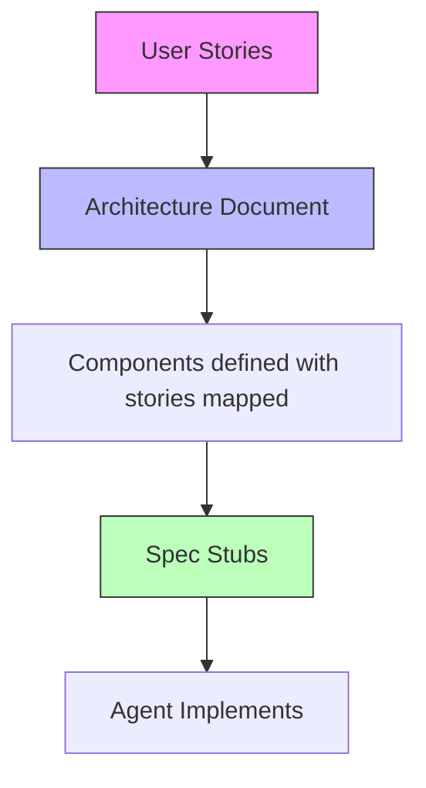
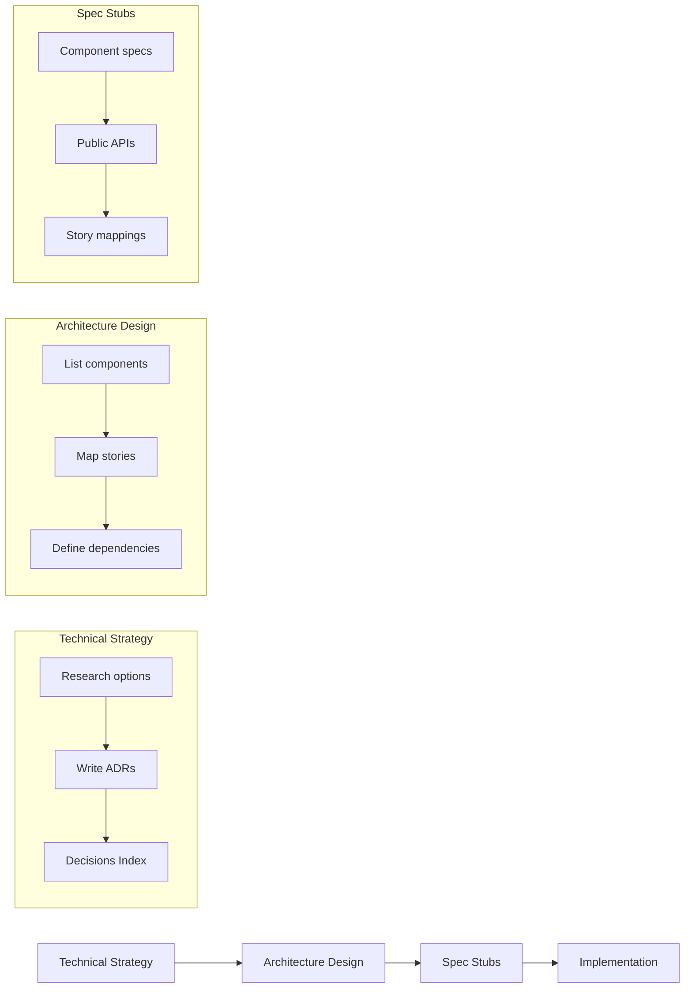

# Architecture Design: Map Your Stories to Components Before the Agent Starts Coding

You've got your [technical strategy](/documentation/technical-strategy-guide) locked down. The agent knows what language, framework, and database. Now it needs to know what to build.

This is where most agentic workflows fall apart. People hand the agent a feature description and let it figure out the structure. Three features later, overlapping modules, circular dependencies, and no separation between UI and business logic.

Write an architecture document. Map your stories to components. The architecture document is the source of truth, not something you generate from code after the fact.

## What an Architecture Document Is

An architecture document maps what your app needs to do (user stories) to what your app is made of (components). For every feature, you define which parts of the system are involved.

Here's what a simple mapping looks like:

```markdown
## Components

### Dashboard Page
Type: Page / View
Stories: 1, 3, 7
Dependencies: Accounts, Analytics

### Settings Page
Type: Page / View
Stories: 4, 5
Dependencies: Accounts

### Accounts
Type: Domain module
Responsibilities: User registration, authentication, organization membership
Models: User, Organization, Membership

### Analytics
Type: Domain module
Responsibilities: Event tracking, report generation, data aggregation
Models: Event, Report
```

Story 1 appears on the Dashboard page, which depends on the Analytics module. You can trace from the user story to the page they interact with to the domain logic that powers it. The agent reads this and knows where things go.

## Why This Matters

Without an architecture document, the agent makes structural decisions for you. It puts business logic in your page handlers. It creates a new module for every feature instead of grouping related logic. It duplicates functionality because it doesn't know what already exists.

The architecture document prevents this by defining boundaries upfront:
- What pages/views/endpoints exist and which stories they serve
- What domain modules exist and what they're responsible for
- How components depend on each other
- Where new features should land

The agent reads this before every task. It knows the component structure, which module owns which logic, the dependency direction. That's how you get coherent code across dozens of features instead of a pile of files that happen to compile.

## The Component Format

Each component in the document gets:

- **Name:** What you call it
- **Type:** Page, API endpoint, domain module, model, service
- **Description:** One sentence on what it's responsible for
- **Stories:** Which user stories this component serves
- **Dependencies:** What other components it depends on

Keep it simple. The point isn't a UML diagram. It's a map the agent can read.



## From Architecture to Spec Stubs

Once the architecture document exists, you can write skeleton spec files for every component. A spec stub defines what a component should do without implementing it:

```markdown
# Accounts Module
Description

## Type
controller

## Public API
- register_user(attrs) -> User or error
- authenticate_user(email, password) -> User or error
- list_organizations(user) -> list of Organizations

## Dependencies
- Users
```

These stubs become the implementation contract. When the agent picks up Story 2, it reads the Accounts spec, sees `register_user`, and implements it. It doesn't invent a new function name. It doesn't put registration logic in the page handler. The spec told it where things go.

If you're using [BDD specs](/blog/bdd-specs-for-ai-generated-code), the acceptance criteria from your stories map directly to test scenarios. The architecture tells the agent where to put the code. The BDD spec tells it what "done" looks like.

## Maintain It, Don't Generate It

The architecture document is not something you generate from code. You write it, maintain it, and the code follows it.

New feature? Update the architecture document first. Add the story mapping. Add new components. Update dependencies. Then implement. Document leads, code follows.

Tools that analyze your codebase and produce diagrams describe what IS. Your architecture document describes what SHOULD BE. When code drifts from the document, the document is right.

## The Full Flow

Putting it together with [technical strategy](/documentation/technical-strategy-guide):



Technical strategy decides WHAT you build with. Architecture design decides WHAT you build. Spec stubs define HOW each piece should work. Implementation is the agent following all three.

## Do This Today

1. **List your user stories.** Even bullet points. What does your app need to do?
2. **Create an architecture document.** One markdown file. List your pages/views and your domain modules.
3. **Map every story to components.** Each story should connect to at least one page and one domain module.
4. **Check dependencies.** Pages depend on domain modules, not the reverse. Look for circular references.
5. **Write spec stubs.** For each component: description, public API, linked stories.
6. **Point your agent at it.** Add to your agent's instructions: "Read the architecture document before creating new files."

You don't need any specific tool. A markdown file, your stories, and 30 minutes of thought about structure. The agent does better work when you give it a map. Without one, it's wandering.
