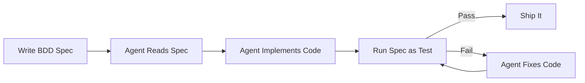

# BDD Specs for AI-Generated Code

BDD was supposed to be dead. Tricentis killed SpecFlow. SmartBear donated Cucumber to the community and walked away. Developers complained for years that Gherkin specs were ceremony for ceremony's sake.

Then AI agents showed up, and that "unnecessary ceremony" turned out to be exactly what they needed.

## Why BDD Is Back

BDD fell out of favor because developers hated writing specs. Dan North created it in 2003. Given/When/Then came from Chris Matts in 2004. The idea was sound: describe what software should do in plain language, automate those descriptions as tests.

The problem was humans. When you already know what you're building, a Gherkin spec feels like translating your thoughts into a format nobody asked for. Most teams skipped the Three Amigos meeting. The developer wrote code, then wrote Gherkin after the fact. The spec became documentation of what was built, not a specification of what should be built.

AI agents changed this. Human developers carry context in their heads. They know what the PM meant even when the ticket is vague. They infer intent from Slack conversations. AI agents don't have any of that. They need structured, unambiguous instructions. They need to know exactly what "done" looks like. As Meir Michanie wrote: "Agents don't need opinions. They need instructions."

That's what a BDD spec is.

Birgitta Bockeler at Thoughtworks made the connection: spec-by-example is "essentially the few-shot prompt technique" applied to software requirements. The arXiv research backs it up: human-refined specifications reduce errors in LLM-generated code by up to 50%.

## "Tests Pass" != "It Works"

I see this constantly. AI generates code. Generates tests. Tests pass. You ship. User finds a bug the tests should have caught.

The tests validate the AI's *interpretation* of what you wanted, not what you actually wanted. Model misunderstands a requirement, writes code that handles it wrong and tests that confirm the wrong behavior. Self-confirming loop.

Unit tests answer: "does this function return the expected output?" They don't answer: "does this application do what the user story said it should do?"

BDD specs break the loop. The source of truth is human-written acceptance criteria, not the AI's assumptions.

## Specs Work in Both Directions

Instructions going in. Verification coming out.



Going in, the spec tells the agent what to build:

```gherkin
Feature: Password Reset

  Scenario: User requests a password reset with a valid email
    Given a registered user with email "alice@example.com"
    When the user requests a password reset
    Then the system sends a reset email to "alice@example.com"
    And the reset link expires in 24 hours

  Scenario: User requests a password reset with an unregistered email
    Given no user exists with email "nobody@example.com"
    When someone requests a password reset for "nobody@example.com"
    Then the system responds with the same success message
    And no email is sent
```

Coming out, that same spec runs as a test. Agent changes something elsewhere, password reset breaks, spec catches it.

## The Vibe Coding Problem

The pattern is predictable. Someone prompts an AI to build an app. Works for the demo. Add features by prompting more. Things break. Prompt to fix. Breaks something else. Two weeks in, nobody knows what the app is supposed to do.

BDD forces the discipline vibe coding skips. Before you tell the agent to build something, you define what "working" means. Concrete scenarios. Specific inputs. Expected outputs. The spec is the contract between you and the agent.

Twenty minutes on a spec saves two hours of prompt iteration.

## What Good Specs Look Like

Write declaratively. What should happen, not how the UI looks. AI agents are especially bad with imperative specs because they couple tests to implementation details that change constantly.

**Bad (imperative):**
```gherkin
When I click the "Login" button
And I type "alice" in the username field
And I type "secret123" in the password field
And I click "Submit"
Then I see the text "Welcome, Alice"
```

**Good (declarative):**
```gherkin
When Alice logs in with valid credentials
Then she has access to her dashboard
```

One behavior per scenario. Domain language, not jargon.

## How I Actually Do It

Every acceptance criterion on every user story becomes an executable BDD scenario. Each test traces back to a specific criterion a human approved.

Story: "When a driver's fuel card is swiped, the system sends an SMS notification within seconds." Criteria: SMS sent on swipe, contains transaction amount and location, includes verification link.

Each criterion gets its own spec file:

```
test/spex/373_sms_notification_with_pwa_link/
  criterion_3705_sms_sent_within_seconds_of_card_swipe_spex.exs
  criterion_3706_sms_contains_transaction_amount_location_timestamp_spex.exs
```

Directory named after the story. File named after the criterion. Look at the file tree, know exactly what's tested and why.

```elixir
spex "SMS sent within seconds of card swipe" do
  scenario "card processor sends authorization event and SMS is triggered" do
    given_ "a valid Stripe issuing_authorization.created webhook payload", context do
      # Sets up a realistic card swipe event
    end

    when_ "the card processor sends the webhook to our endpoint", context do
      conn = post(context.conn, "/api/webhooks/card-swipe", context.webhook_payload)
      {:ok, Map.put(context, :conn, conn)}
    end

    then_ "the webhook responds with success", context do
      assert json_response(context.conn, 200)
    end

    then_ "the response confirms an SMS notification was queued", context do
      response = json_response(context.conn, 200)
      assert response["sms_status"] in ["queued", "sent"]
    end
  end
end
```

Agent generates specs from user stories, not from code. Source of truth is what you told the system to build.

On Fuellytics (fuel card management, fraud detection, Stripe Treasury), this produced 20+ story directories. Over 31,000 lines of test code.

## Specs at the Boundary

The most effective BDD specs exercise the full application at its boundaries with realistic I/O. Not mocked. Not simplified. Realistic recordings of what actually flows across the boundary.

Most applications have two or three interaction surfaces. A web app has HTTP requests from the browser and API calls to external services. A coding harness has the filesystem (agent reads/writes files), the UI (user interacts through the browser), and tool calls (model invokes MCP servers).

The spec provides realistic inputs at one boundary and asserts on realistic outputs at another. Everything in between is the application doing its job.

```gherkin
Scenario: Card swipe triggers SMS notification
  Given a Stripe issuing_authorization.created webhook with amount $47.50 at "Shell Station #4421"
  When the webhook hits /api/webhooks/card-swipe
  Then the system queues an SMS to the card holder
  And the SMS contains "$47.50" and "Shell Station #4421"
  And the SMS contains a verification link with a valid token
```

This spec exercises the full path: webhook in, SMS out. The fixture is a realistic Stripe payload, not a simplified mock. The assertion checks what actually gets sent, not internal state.

Compare to a unit test that checks "the SMS service was called with the right arguments." That confirms implementation details. The boundary spec confirms the system works end-to-end from the perspective of the external systems it talks to.

The three amigos process (product owner, developer, tester) produces these boundary specs by asking: what comes in? What goes out? What are the edge cases at the boundary? The examples that emerge from that conversation become your fixtures.

## What This Catches (and Doesn't)

BDD specs catch requirement misunderstandings and regressions. They catch the case where the AI built something that technically works but doesn't match the user story. Boundary specs specifically catch integration failures that unit tests miss.

They don't catch everything. They don't catch UX issues, performance problems, or edge cases you didn't think to specify. That's [agentic QA](/blog/agentic-qa), a different verification layer. BDD specs reduce how much QA has to catch. They don't eliminate it.

## What to Tell Your AI

1. **Write the spec first.** Three to five Gherkin scenarios. Happy path and critical edge cases.

2. **Put it in the repo.** `.feature` files in `features/` or `specs/`. Agent reads them as context.

3. **Implement against the spec.** Not "build me a login system." Say "implement `features/authentication.feature` and make all scenarios pass."

4. **Run specs after every change.** Regression safety net. Spec goes red, you know immediately.

5. **Iterate specs, not just code.** Requirements change? Update the spec first. Then tell the agent to make them pass again.

BDD isn't back because someone invented something new. It's back because the thing it always provided finally has a consumer that actually wants it.

---

**Sources:**
- [Dan North - Introducing BDD](https://dannorth.net/blog/introducing-bdd/) (2006)
- [Birgitta Bockeler / Thoughtworks - Spec-Driven Development](https://www.thoughtworks.com/insights/blog/agile-engineering-practices/spec-driven-development-unpacking-2025-new-engineering-practices)
- [arXiv - Spec-Driven Development: From Code to Contract](https://arxiv.org/html/2602.00180v1)
- [Meir Michanie - Why BDD Is Essential in the Age of AI Agents](https://medium.com/@meirgotroot/why-bdd-is-essential-in-the-age-of-ai-agents-65027f47f7f6)
- [Andy Knight / Automation Panda - Is BDD Dying?](https://automationpanda.com/2025/03/06/is-bdd-dying/)
- [Cucumber - Anti-Patterns](https://cucumber.io/blog/bdd/cucumber-antipatterns-part-one/)
- [GitHub Blog - Spec-Driven Development with AI](https://github.blog/ai-and-ml/generative-ai/spec-driven-development-with-ai-get-started-with-a-new-open-source-toolkit/)
