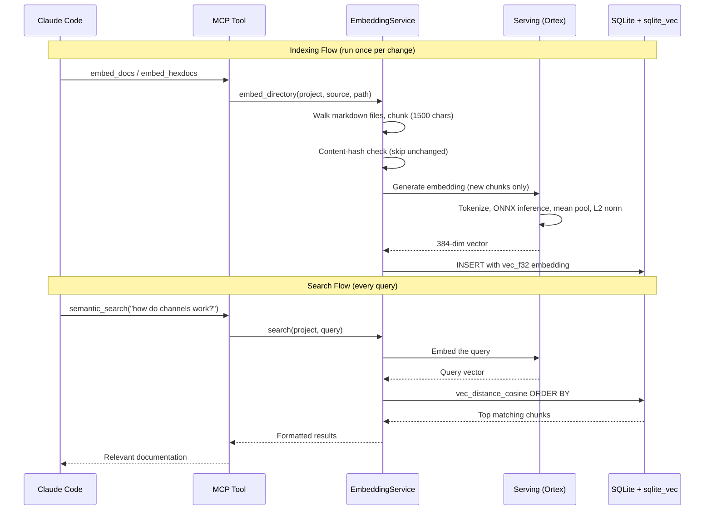

# How I Built a Local Embedding Pipeline in Elixir That Searches My Own Docs

I wanted Claude Code to search my project docs and hex dependency docs without calling an external API. No OpenAI embeddings endpoint. No network. Everything local. Here's what I built.

## The Architecture



### 1. DocExtractor: Pulling Markdown Out of Compiled Bytecode

This is the part I'm most proud of. Every compiled Elixir module has documentation baked into the BEAM file as an EEP-48 chunk. It's already markdown. You just read it out.

```elixir
defp extract_beam(path) do
  with {:ok, binary} <- File.read(path),
       {:ok, {mod, [{~c"Docs", docs_bin}]}} <- :beam_lib.chunks(binary, [~c"Docs"]),
       {:docs_v1, _anno, _lang, format, mod_doc, _meta, func_docs} <-
         :erlang.binary_to_term(docs_bin) do
    if format == "text/markdown" do
      [%{module: mod, markdown: render_module(mod, mod_doc, func_docs)}]
    else
      []
    end
  else
    _ -> []
  end
end
```

No network. No HTML parsing. No scraping hexdocs.pm. Just `:beam_lib.chunks/2` on the compiled files in `_build/`. The docs are right there in the bytecode.

The extractor walks every `.beam` file in a dependency's ebin directory, pulls the EEP-48 chunk, checks that the format is markdown, and renders module doc plus function docs into a single markdown string.

### 2. Serving: Local Embeddings with Ortex

The embedding model runs entirely on my machine.

```elixir
defmodule CodeMySpec.Embeddings.Serving do
  use GenServer

  @model_path "priv/models/all-MiniLM-L6-v2.onnx"
  @tokenizer_id "sentence-transformers/all-MiniLM-L6-v2"
  @max_length 256
```

GenServer running all-MiniLM-L6-v2 through Ortex (Elixir's ONNX Runtime binding). Model ships in `priv/models/`. Tokenizer downloads from HuggingFace on first use and caches.

The pipeline: tokenize, truncate and pad to uniform length, build Nx tensors (ONNX BERT expects int64), run Ortex inference, mean pool hidden states with attention mask, L2 normalize. Out come 384-dimensional embeddings.

I picked all-MiniLM-L6-v2 because it's 80MB, fast, and good enough for doc search. No need for a giant model when you're matching "how do I create a Phoenix channel" against API docs.

### 3. EmbeddingService: Chunk, Deduplicate, Store

Takes a directory of markdown, chunks it (1500 chars, 200 overlap), embeds the chunks, stores in SQLite with sqlite_vec.

Content-hash deduplication: unchanged chunks skip re-embedding. Re-indexing the whole knowledge base after editing one file takes seconds.

```elixir
defp content_hash(text) do
  :crypto.hash(:sha256, text) |> Base.encode16(case: :lower)
end
```

Search is cosine distance via sqlite_vec:

```elixir
sql = """
SELECT e.source, e.path, e.chunk_index, e.content
FROM doc_embeddings e
WHERE e.project_id = ?1
ORDER BY vec_distance_cosine(e.embedding, vec_f32(?3))
LIMIT ?2
"""
```

No Pinecone. No Weaviate. Just SQLite with the vec extension sitting next to my app data.

### 4. MCP Tools: Claude Code Interface

Two MCP tools expose the search:

**semantic_search** - Search project knowledge, specs, rules, design docs. Claude asks "find docs about authentication" and gets the most relevant chunks.

**search_hexdocs** - Search embedded hex dependency docs. Claude asks "how does Phoenix.Channel handle joins" and gets actual current API docs, not hallucinated ones from training data.

Same embedding service under the hood. Different source filter.

## The Stack

| Component | Library | Purpose |
|-----------|---------|---------|
| Model inference | Ortex (ONNX Runtime) | Run all-MiniLM-L6-v2 locally |
| Tokenization | Tokenizers (HuggingFace) | BERT tokenization |
| Tensor math | Nx | Mean pooling, L2 normalization |
| Vector storage | sqlite_vec | Cosine distance search |
| Database | SQLite via Ecto | Chunk storage, deduplication |
| MCP server | Anubis | Tool interface for Claude Code |

Everything runs in the same BEAM VM as my Phoenix app. No sidecar services. No Docker containers for vector databases. No API keys.

## Why This Matters

The hex docs extraction is the thing I haven't seen anyone else do. Most embedding pipelines start with "scrape the docs website" or "call the API." In Elixir, the docs are already compiled into the bytecode. EEP-48 was designed for programmatic access to documentation. I'm just using it for something the authors probably didn't anticipate.

Local-first means it works offline, costs nothing per query, and keeps my project data out of third-party services. Content-hash deduplication means I can re-index aggressively without wasting compute.

Because it's all exposed through MCP, Claude Code searches my docs mid-task without me copying and pasting anything. It asks for what it needs, searches the embeddings, and gets accurate, current documentation back.

## What I'd Do Differently

The chunking is naive - character count with overlap. I'd rather chunk on markdown headers so each chunk is a semantically complete section. Right now a function doc can split across two chunks.

No reranking yet. Cosine distance is good enough for doc search, but a cross-encoder reranker would help for nuanced queries.

And I want automatic re-embedding on file watch. Right now I trigger it manually or through the MCP tool. A file system watcher that re-embeds on save would close the loop.
