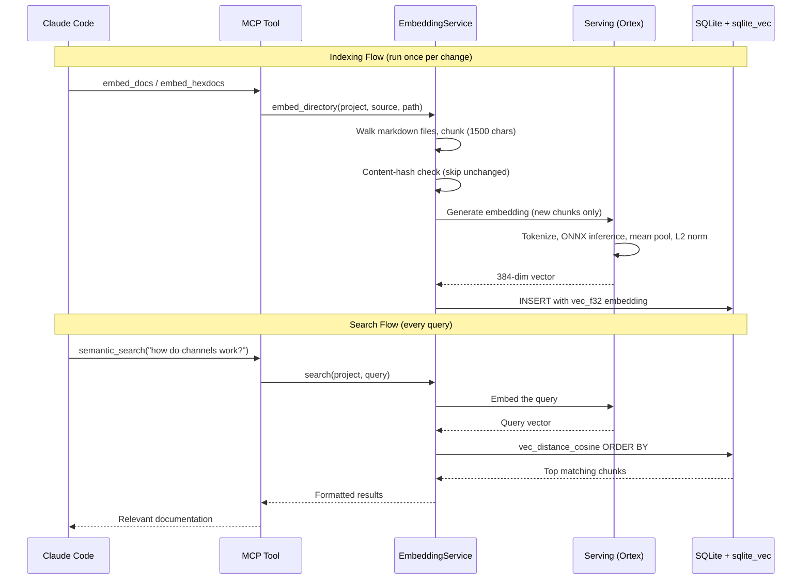

# How I Built a Local Embedding Pipeline in Elixir That Searches My Own Docs

I wanted my Elixir harness to search HexDocs for all my current dependency versions and my project documentation without calling an external API. No OpenAI embeddings endpoint. No Ollama sidecar. No network calls. Everything embedded in the desktop app.

I got inspired by the [HexDocs MCP server](https://hexdocs.pm/hexdocs_mcp/readme.html). They had a cool approach, but they were scraping HexDocs instead of using the local dependencies, and they were embedding with Ollama through a Node MCP server. I wanted it all contained inside my harness, which is an Elixir desktop app built with Burrito. That constraint shaped every decision.

## The Architecture



### 1. DocExtractor: Pulling Markdown Out of Compiled Bytecode

This is the part I'm most proud of. The docs are already markdown, baked right into the BEAM bytecode. You don't need to scrape anything. My extractor uses `:beam_lib.chunks/2` to read the raw doc chunks directly from `.beam` files in `_build/`:

```elixir
defp extract_beam(path) do
  with {:ok, binary} <- File.read(path),
       {:ok, {mod, [{~c"Docs", docs_bin}]}} <- :beam_lib.chunks(binary, [~c"Docs"]),
       {:docs_v1, _anno, _lang, format, mod_doc, _meta, func_docs} <-
         :erlang.binary_to_term(docs_bin) do
    if format == "text/markdown" do
      [%{module: mod, markdown: render_module(mod, mod_doc, func_docs)}]
    else
      []
    end
  else
    _ -> []
  end
end
```

No network. No HTML parsing. No scraping hexdocs.pm. The docs are right there in the compiled files. Every dependency you've compiled already has its documentation sitting in `_build/`. I just walk the ebin directory, pull the EEP-48 chunks, and render module docs plus function docs into markdown strings.

### 2. Serving: Local Embeddings with Ortex

My first attempt was with Bumblebee and Nx. That failed because I couldn't get it wrapped into Burrito (the tool I use to package the desktop app). Ortex worked because it's just ONNX Runtime with a clean NIF - no complex build dependencies.

```elixir
defmodule CodeMySpec.Embeddings.Serving do
  use GenServer

  @model_path "priv/models/all-MiniLM-L6-v2.onnx"
  @tokenizer_id "sentence-transformers/all-MiniLM-L6-v2"
  @max_length 256
```

It's a GenServer that loads all-MiniLM-L6-v2 through Ortex. The ONNX model ships with the app in `priv/models/`. Tokenizer downloads from HuggingFace on first use and caches locally.

The inference pipeline: tokenize with the HuggingFace tokenizer, truncate and pad to uniform length, build Nx tensors (ONNX BERT expects int64), run through Ortex, mean pool the hidden states with the attention mask, L2 normalize. Out come 384-dimensional embeddings. Nx is still in the stack for the tensor math - mean pooling and normalization.

I picked all-MiniLM-L6-v2 because it's 80MB, fast, and good enough for doc search. No need for a giant model when you're matching "how do I create a Phoenix channel" against API docs.

### 3. EmbeddingService: Chunk, Deduplicate, Store in sqlite_vec

Takes a directory of markdown, chunks it (1500 chars, 200 overlap), embeds the chunks, and stores everything in SQLite using the sqlite_vec extension for vector search.

Content-hash deduplication: unchanged chunks skip re-embedding. Re-indexing the whole knowledge base after editing one file takes seconds because only changed chunks get re-embedded.

```elixir
defp content_hash(text) do
  :crypto.hash(:sha256, text) |> Base.encode16(case: :lower)
end
```

sqlite_vec gives me cosine distance search right inside SQLite. No separate vector database. No Pinecone. No Weaviate. Just an extension on the database I'm already using:

```elixir
sql = """
SELECT e.source, e.path, e.chunk_index, e.content
FROM doc_embeddings e
WHERE e.project_id = ?1
ORDER BY vec_distance_cosine(e.embedding, vec_f32(?3))
LIMIT ?2
"""
```

Embeddings stored as `vec_f32` columns. The schema uses `SqliteVec.Ecto.Float32` for the Ecto type. Everything sits right next to my app data in the same database file.

### 4. MCP Tools: Claude Code Interface

Two MCP tools expose the search to Claude Code:

**semantic_search** - Search project knowledge, specs, rules, design docs. Claude asks "find docs about authentication" and gets the most relevant chunks.

**search_hexdocs** - Search embedded hex dependency docs. Claude asks "how does Phoenix.Channel handle joins" and gets the actual current API docs for whatever version I'm running, not hallucinated ones from training data.

Same embedding service under the hood, different source filter.

## The Stack

| Component | Library | Purpose |
|-----------|---------|---------|
| Doc extraction | Code.fetch_docs / :beam_lib | EEP-48 markdown from BEAM files |
| Model inference | Ortex (ONNX Runtime) | Run all-MiniLM-L6-v2 locally |
| Tokenization | Tokenizers (HuggingFace) | BERT tokenization |
| Tensor math | Nx | Mean pooling, L2 normalization |
| Vector storage | sqlite_vec | Cosine distance search |
| Database | SQLite via Ecto | Chunk storage, deduplication |
| MCP server | Anubis | Tool interface for Claude Code |

Everything runs in the same BEAM VM. No sidecar services. No Docker containers for vector databases. No API keys. The whole thing packages into a Burrito desktop app.

## What I'd Do Differently

The chunking is naive - character count with overlap. I'd rather chunk on markdown headers so each chunk is a semantically complete section. Right now a function doc can split across two chunks.

No reranking yet. Cosine distance is good enough for doc search, but a cross-encoder reranker would help for nuanced queries.

And I want automatic re-embedding on file watch. Right now I trigger it manually or through the MCP tool. A file system watcher that re-embeds on save would close the loop.
