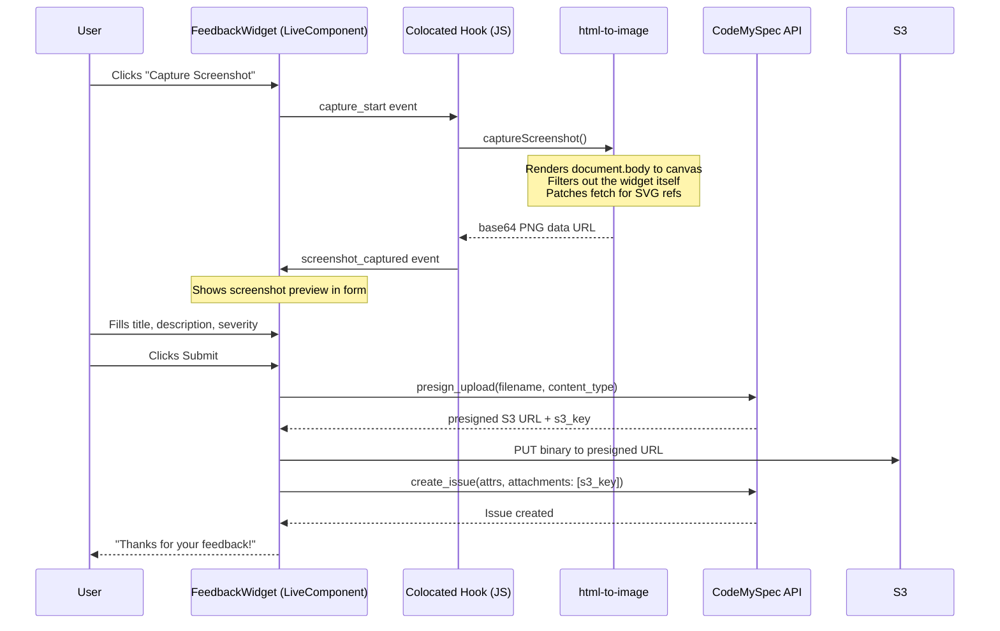

# How the CodeMySpec Feedback Widget Captures Screenshots in LiveView

I built a feedback widget that captures screenshots. One click, it grabs exactly what the user sees, uploads to S3, attaches it to the bug report. No page navigation, no browser extensions.

## The Widget

Floating LiveComponent. Chat bubble in the bottom-right. Click it, fill out title/description/severity, optionally grab a screenshot, submit. Issue shows up in CodeMySpec with the screenshot attached.

It checks its own OAuth connection on mount. No CodeMySpec integration? Renders nothing. No hooks, no prop-drilling. Drop it in root.html.heex and forget about it.



## The Screenshot Capture

The fun part. User clicks "Capture Screenshot" and the widget grabs exactly what's on screen. Not a browser API screenshot - a rendered-to-canvas capture of the DOM.

### The JavaScript

```javascript
import { toCanvas } from "html-to-image";

export async function captureScreenshot() {
  const origFetch = window.fetch;
  window.fetch = function(input, init) {
    const url = typeof input === "string" ? input : input?.url || "";
    if (url.includes("%23") || url.includes("#")) {
      return Promise.resolve(new Response("", { status: 200 }));
    }
    return origFetch.call(this, input, init);
  };

  try {
    const canvas = await toCanvas(document.body, {
      pixelRatio: Math.min(window.devicePixelRatio, 2),
      skipFonts: true,
      width: window.innerWidth,
      height: window.innerHeight,
      style: {
        transform: `translate(-${window.scrollX}px, -${window.scrollY}px)`,
      },
      canvasWidth: window.innerWidth,
      canvasHeight: window.innerHeight,
      filter: (node) => {
        if (node.id === "cms-feedback") return false;
        return true;
      },
    });
    return canvas.toDataURL("image/png");
  } finally {
    window.fetch = origFetch;
  }
}

window.__captureScreenshot = captureScreenshot;
```

Three things I want to call out:

**The fetch monkey-patch.** `html-to-image` fetches every URL in the DOM, including SVG `url(#id)` refs. Those aren't real URLs. The library turns them into fetch requests that 404 and spam the console. The patch intercepts any fetch with `#` and returns an empty 200. Ugly, effective. Restored in `finally`.

**Self-filtering.** The `filter` callback skips `node.id === "cms-feedback"`. The screenshot captures the page without the feedback form floating on top of it.

**Scroll position.** The `style.transform` offset accounts for scroll. Without it you capture the top of the page. With it you capture exactly the viewport the user is looking at.

### The Colocated Hook

Phoenix 1.8 colocated hooks are one of my favorite features. The JS lives right in the template:

```elixir
<script :type={Phoenix.LiveView.ColocatedHook} name=".CmsScreenshot">
  export default {
    mounted() {
      this.el.addEventListener("click", async (e) => {
        if (!e.target.closest("[data-capture-screenshot]")) return;
        this.pushEventTo(this.el, "capture_start", {});
        try {
          const dataUrl = await window.__captureScreenshot();
          this.pushEventTo(this.el, "screenshot_captured", { data: dataUrl });
        } catch (err) {
          console.error("Screenshot capture failed:", err);
          this.pushEventTo(this.el, "screenshot_captured", { data: null });
        }
      });
    },
  }
</script>
```

No separate JS file. No app.js registration. The hook lives where it's used. Listens for clicks on `[data-capture-screenshot]`, calls the screenshot function, pushes the result back to the LiveComponent.

Two-event flow (`capture_start` then `screenshot_captured`) so the widget can show a spinner. Canvas rendering can take a second on complex pages.

## The Upload Flow

Presigned S3 upload. The app server never touches the file:

```elixir
defp upload_screenshot(scope, data_url) do
  with [_, base64] <- Regex.run(~r/^data:image\/png;base64,(.+)$/, data_url),
       {:ok, binary} <- Base.decode64(base64),
       {:ok, %{upload_url: url, s3_key: key}} <- Client.presign_upload(scope, "screenshot.png", "image/png") do
    case Req.put(url, body: binary, headers: [{"content-type", "image/png"}]) do
      {:ok, %Req.Response{status: status}} when status in 200..299 ->
        {:ok, %{"s3_key" => key, "filename" => "screenshot.png", "content_type" => "image/png", "size" => byte_size(binary)}}
      _ ->
        {:error, :upload_failed}
    end
  end
end
```

Decode base64 to binary. Get a presigned URL from CodeMySpec. PUT directly to S3. Issue gets the S3 key as a reference.

## The Generator

Ships as a Mix generator:

```bash
$ mix cms_gen.feedback_widget
```

Three files:
- `feedback_widget.ex` - the LiveComponent
- `codemyspec/client.ex` - HTTP client for the API
- `screenshot.js` - the capture logic

Drop the component in your root layout, install `html-to-image`, configure OAuth. Done.

## Why I'm Proud of This

I've spent years reading bug reports that say "the button doesn't work." Now they say "the button doesn't work" plus a picture of exactly what the user was looking at. Gets you 80% of the way to reproducing the issue before you even open the code.

The colocated hook is what makes it feel clean. Before Phoenix 1.8, you'd have a JS file in app.js conceptually tied to a LiveView but physically somewhere else. Now I read the widget code and the hook is right there.
