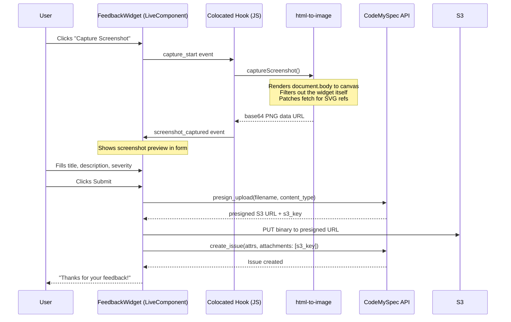

# How the CodeMySpec Feedback Widget Captures Screenshots in LiveView

I built a feedback widget that lets users report issues from inside the app. The part I'm proudest of is the screenshot capture - one click and it grabs exactly what the user is looking at, uploads it to S3, and attaches it to the issue. All without leaving the page.

## The Widget

It's a floating LiveComponent. Little chat bubble in the bottom-right corner. Click it, fill out a title, description, severity, optionally capture a screenshot, submit. The issue shows up in CodeMySpec with the screenshot attached.

The widget checks its own connection status on mount. If the user hasn't connected their app to CodeMySpec via OAuth, it renders nothing. No hooks, no prop-drilling, no layout changes needed. Just drop it in root.html.heex and it handles itself.



## The Screenshot Capture

This is the fun part. The user clicks "Capture Screenshot" and the widget grabs exactly what's on screen right now. Not a browser API screenshot - a rendered-to-canvas capture of the DOM.

### The JavaScript

```javascript
import { toCanvas } from "html-to-image";

export async function captureScreenshot() {
  // Suppress 404 noise from html-to-image trying to fetch url(#id) SVG refs
  const origFetch = window.fetch;
  window.fetch = function(input, init) {
    const url = typeof input === "string" ? input : input?.url || "";
    if (url.includes("%23") || url.includes("#")) {
      return Promise.resolve(new Response("", { status: 200 }));
    }
    return origFetch.call(this, input, init);
  };

  try {
    const canvas = await toCanvas(document.body, {
      pixelRatio: Math.min(window.devicePixelRatio, 2),
      skipFonts: true,
      width: window.innerWidth,
      height: window.innerHeight,
      style: {
        transform: `translate(-${window.scrollX}px, -${window.scrollY}px)`,
      },
      canvasWidth: window.innerWidth,
      canvasHeight: window.innerHeight,
      filter: (node) => {
        if (node.id === "cms-feedback") return false;
        return true;
      },
    });
    return canvas.toDataURL("image/png");
  } finally {
    window.fetch = origFetch;
  }
}

window.__captureScreenshot = captureScreenshot;
```

Three things worth noting:

**The fetch monkey-patch.** `html-to-image` tries to fetch every URL it finds in the DOM, including SVG `url(#id)` references. Those aren't real URLs - they're internal SVG references. The library turns them into fetch requests that 404 and spam the console. The patch intercepts any fetch containing `#` and returns an empty 200. Ugly but effective. The original fetch is restored in the `finally` block.

**The widget filters itself out.** The `filter` callback checks `node.id === "cms-feedback"` and returns false. The screenshot captures the page as the user sees it, without the feedback form floating on top.

**Scroll position handling.** The `style.transform` offset accounts for where the user has scrolled. Without this, you'd capture the top of the page regardless of scroll position. With it, you capture exactly the viewport the user is looking at.

### The Colocated Hook

Phoenix 1.8 lets you colocate JavaScript hooks directly in the LiveView template:

```elixir
<script :type={Phoenix.LiveView.ColocatedHook} name=".CmsScreenshot">
  export default {
    mounted() {
      this.el.addEventListener("click", async (e) => {
        if (!e.target.closest("[data-capture-screenshot]")) return;
        this.pushEventTo(this.el, "capture_start", {});
        try {
          const dataUrl = await window.__captureScreenshot();
          this.pushEventTo(this.el, "screenshot_captured", { data: dataUrl });
        } catch (err) {
          console.error("Screenshot capture failed:", err);
          this.pushEventTo(this.el, "screenshot_captured", { data: null });
        }
      });
    },
  }
</script>
```

No separate JS file for the hook. No app.js registration. The hook lives right next to the template that uses it. It listens for clicks on `[data-capture-screenshot]`, calls the global screenshot function, and pushes the result back to the LiveComponent.

The two-event flow (`capture_start` then `screenshot_captured`) lets the widget show a "Capturing..." spinner while the canvas renders. On a complex page that render can take a second.

## The Upload Flow

Once the user has a screenshot and submits the form, the upload is a three-step presigned flow:

```elixir
defp upload_screenshot(scope, data_url) do
  with [_, base64] <- Regex.run(~r/^data:image\/png;base64,(.+)$/, data_url),
       {:ok, binary} <- Base.decode64(base64),
       {:ok, %{upload_url: url, s3_key: key}} <- Client.presign_upload(scope, "screenshot.png", "image/png") do
    case Req.put(url, body: binary, headers: [{"content-type", "image/png"}]) do
      {:ok, %Req.Response{status: status}} when status in 200..299 ->
        {:ok, %{"s3_key" => key, "filename" => "screenshot.png", "content_type" => "image/png", "size" => byte_size(binary)}}
      _ ->
        {:error, :upload_failed}
    end
  end
end
```

1. Decode the base64 data URL back to binary
2. Ask the CodeMySpec API for a presigned S3 upload URL
3. PUT the binary directly to S3

The app server never touches the file. The presigned URL means S3 handles the upload directly. The issue just gets the S3 key as a reference.

## The Generator

The whole thing ships as a Mix generator:

```bash
$ mix cms_gen.feedback_widget
```

It generates three files:
- `lib/app_web/live/feedback_widget.ex` - the LiveComponent
- `lib/app/codemyspec/client.ex` - HTTP client for the CodeMySpec API
- `assets/js/screenshot.js` - the screenshot capture

Drop the component in your root layout, install `html-to-image`, configure your OAuth credentials. That's it.

The generator approach means every app that integrates with CodeMySpec gets the same widget with the same screenshot capability. No copy-pasting. No maintaining forks. Just run the generator and you have a working feedback system with screenshot capture.

## Why I Like This

The screenshot makes bug reports actually useful. "The button doesn't work" becomes "the button doesn't work" plus a picture of exactly what the user was looking at. I've spent years reading bug reports that describe something I can't reproduce. Screenshots don't solve that entirely, but they get you 80% of the way there.

The colocated hook is one of my favorite Phoenix 1.8 features. Before this, you'd have a JS file registered in app.js that's conceptually tied to a specific LiveView but physically separated from it. Now the hook lives where it's used. When I read the widget code, I see the hook right there.
