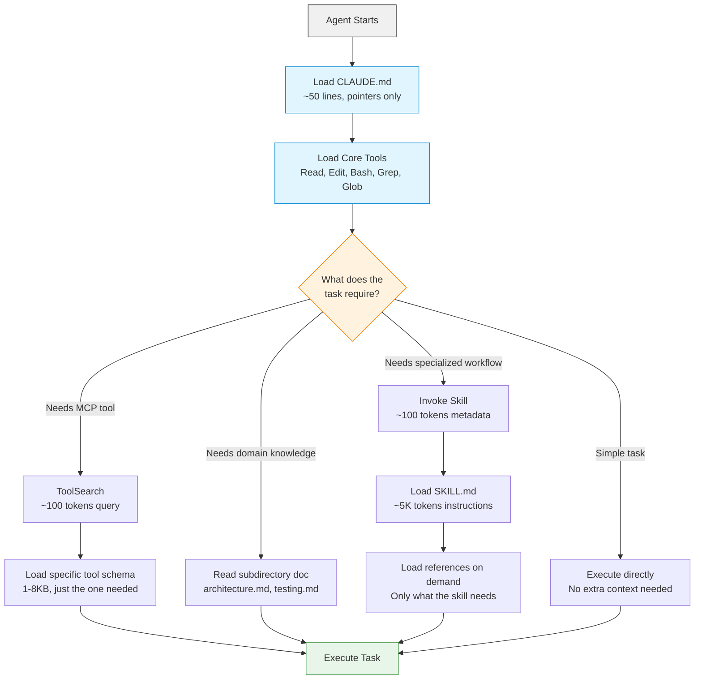

# What Is Progressive Disclosure and Why It Matters for AI Agents

*A 30-year-old UX principle is the most important technique in AI agent context management. Here's why, and how to use it.*

---

Boris Cherny, the creator of Claude Code, recently [debugged a user's problem](https://www.threads.com/@boris_cherny/post/DSnyfjUCGZ2/) over DMs. The user's agent was underperforming. Slow, confused, picking the wrong tools. The diagnosis? MCP servers and skills were consuming over 50% of the context window before the user typed a single word. Cherny's advice: "audit your /context from time to time."

This is the problem nobody talks about. We keep giving agents more tools, more skills, more knowledge, and they keep getting worse. Not because the models are bad, but because we're drowning them in context they don't need yet.

The fix is a concept from 1980s interface design. It's called progressive disclosure, and it turns out to be the defining architectural pattern for AI agent context management.

## The Original Insight

Jakob Nielsen [defined progressive disclosure](https://www.nngroup.com/articles/progressive-disclosure/) as a design strategy: show users only what they need right now, and defer everything else to a secondary screen. The concept is older than the web. It comes from early GUI research in the 1970s and 1980s.

Think about a print dialog. You see "Print" and "Cancel." Maybe page range and copies. That's it. Margins, paper size, duplex settings, color profiles? Hidden behind an "Advanced" button. Not because those features don't matter, but because most people don't need them most of the time.

Nielsen found that progressive disclosure improves three of five core usability metrics: learnability, efficiency, and error rate. [The Decision Lab](https://thedecisionlab.com/reference-guide/design/progressive-disclosure) frames this through cognitive load theory. When you present too many options at once, people freeze, make mistakes, or give up.

The same thing happens to language models. Give a model 200 tool definitions and it picks the wrong tool [seven out of eight times](https://www.agentpmt.com/articles/thousands-of-mcp-tools-zero-context-left-the-bloat-tax-breaking-ai-agents). Give it 15 relevant tools and it works fine. The cognitive load problem is not uniquely human.

## Context Is a Budget, Not a Dump Truck

Here's the math that should change how you think about context windows.

Attention is O(n^2). [Doubling your context quadruples the processing cost](https://www.shaped.ai/blog/context-window-optimization-why-ranking-not-stuffing-is-the-scaling-law-for-agents). That 200K context window isn't free. Every token of tool metadata you load at startup is a token you can't use for actual work, and it makes the work you do more expensive.

It gets worse. Models have [U-shaped recall](https://datagrid.com/blog/optimize-ai-agent-context-windows-attention): they remember the beginning and end of the context window well, but the middle is a dead zone. So all that tool metadata sitting in the middle of your context? The model is barely paying attention to it anyway.

[Honra calls this "context rot"](https://www.honra.io/articles/progressive-disclosure-for-ai-agents): agents perform worse with excessive upfront information. They hallucinate false connections. They over-call tools. They enter retry loops. The more you give them, the dumber they get.

[Research on cognitive load in LLMs](https://arxiv.org/html/2509.19517v2) confirms this isn't anecdotal. Extraneous information produces graded, reproducible performance degradation. It's not a cliff. It's a slope. Every unnecessary token makes the model a little worse.

The reality is that context is currency. You have a budget. Spend it on what matters for the task at hand.

## The MCP Tool Bloat Problem

MCP is awesome for connecting agents to external services. It's also the fastest way to destroy your agent's performance.

Each MCP server exports a set of tools. Each tool definition includes a name, description, and full JSON schema for its parameters. That runs 1-8KB per tool. A typical server exports 20-80 tools. Connect ten servers and you're looking at tens of thousands of tokens of tool definitions loaded at startup. [Five MCP servers can burn roughly 55,000 tokens](https://www.anthropic.com/engineering/advanced-tool-use) before the agent reads your first message.

[Junia documented this problem thoroughly](https://www.junia.ai/blog/mcp-context-window-problem): models "get dumber mid-task" as tool metadata displaces actual instructions. The agent starts strong, then goes off the rails because the important context has been pushed into the attention dead zone by tool schemas it doesn't need.

Anthropic's own engineering team measured the impact. Their [code execution approach](https://www.anthropic.com/engineering/code-execution-with-mcp) (having agents write code to call tools instead of using tool definitions directly) showed a 47% reduction in total token usage. Claude Code's [ToolSearch feature](https://platform.claude.com/docs/en/agents-and-tools/tool-use/tool-search-tool) achieves over 85% reduction in typical multi-server setups by deferring tool schemas and loading them on demand.

The pattern is clear: don't load everything at once. Load what you need, when you need it.

## Skills Are Progressive Disclosure

If you're using Claude Code, you already have progressive disclosure built in. Skills are the mechanism.

Here's how the three-tier pattern works:

```
Tier 1: DISCOVERY (~100 tokens per skill)
  Skill name + short description in the tool catalog.
  Loaded at startup. Cheap.

Tier 2: ACTIVATION (~5,000 tokens)
  SKILL.md file read on invocation.
  Instructions, context, workflow steps.

Tier 3: EXECUTION (variable)
  Reference files read on demand.
  Code examples, data files, templates.
  Only loaded if the skill actually needs them.
```

[Lee Han Chung's deep dive](https://leehanchung.github.io/blogs/2025/10/26/claude-skills-deep-dive/) into the mechanics is the best breakdown I've seen. The key insight: skills modify both the conversation context and the execution context, but only when invoked.

The [Lazy Skills analysis](https://boliv.substack.com/p/lazy-skills-a-token-efficient-approach) puts hard numbers on this: 97% token savings with no capability loss. At startup, each skill costs roughly 50-100 tokens for its metadata. Loading every skill body upfront would cost hundreds of thousands of tokens.

[HumanLayer learned this the hard way](https://www.humanlayer.dev/blog/skill-issue-harness-engineering-for-coding-agents): "We kept stuffing every instruction and tool into the system prompt, and the agent kept getting worse." Skills that activate conditionally through SKILL.md files fixed the problem.

This is the same pattern Nielsen described in the 1990s. Show the print button. Hide the margins setting. Load it when someone clicks "Advanced."

## Your CLAUDE.md Is Probably Too Long

I see people with 500-line CLAUDE.md files wondering why their agent is slow and confused. That's the equivalent of showing every setting on the first screen.

[HumanLayer keeps their root CLAUDE.md under 60 lines](https://www.humanlayer.dev/blog/writing-a-good-claude-md). [Alex Op recommends under 50](https://alexop.dev/posts/stop-bloating-your-claude-md-progressive-disclosure-ai-coding-tools/). The principle is the same: tell the agent how to find information, not all the information.

Here's the structure that works. Your root CLAUDE.md is a table of contents:

```markdown
# Project Name

Read `docs/architecture.md` before making structural changes.
Read `docs/testing.md` before writing tests.
Read `docs/api.md` before modifying endpoints.

## Quick Reference
- Language: Elixir
- Framework: Phoenix 1.8
- Test command: mix test
- Deploy: fly deploy
```

That's it. Maybe 30 lines. The agent reads the architecture doc when it needs to make structural changes. It reads the testing doc when it needs to write tests. It doesn't load everything at startup.

[Alex Op nails the framing](https://alexop.dev/posts/stop-bloating-your-claude-md-progressive-disclosure-ai-coding-tools/): stateless sessions are a design constraint to optimize around, not fight. Every session starts fresh. Instead of trying to front-load everything, build a filesystem structure the agent can navigate.

The three tiers map cleanly:

1. **Universal context** (CLAUDE.md, ~50 lines): project identity, pointers to docs
2. **Domain-specific docs** (subdirectories): architecture, testing, API conventions
3. **Specialized agents** (skills, subagents): deep expertise loaded on demand

## Progressive Disclosure Flow

Here's how this looks as an architecture:



The key: at every decision point, the agent loads only what it needs for the next step. Nothing is preloaded "just in case."

## Practical Patterns You Can Use Today

Here's what to actually do. These patterns work right now, today, with Claude Code.

| Pattern | How It Works | When to Use It |
|---------|-------------|----------------|
| **Minimal CLAUDE.md** | 50 lines max. Pointers to docs, not docs themselves. | Every project |
| **Subdirectory docs** | `/docs/architecture.md`, `/docs/testing.md`, etc. | Projects with multiple concern areas |
| **Skills directories** | `.claude/skills/deploy/SKILL.md` with bundled context | Repeatable workflows (deploy, review, migrate) |
| **ToolSearch** | Defer MCP tool schemas, search on demand | More than 10-15 MCP tools |
| **Subagent delegation** | [Offload tasks to agents with clean context](https://www.threads.com/@boris_cherny/post/DUMZy85EoFj/) | Parallel workstreams, long conversations |
| **File reference systems** | [Peek/load/extract](https://lethain.com/agents-large-files/) instead of full ingestion | Large files, codebases with big config files |
| **Progress files** | [Cross-session state via `progress.md`](https://www.anthropic.com/engineering/effective-harnesses-for-long-running-agents) | Multi-session work, long-running agents |
| **Index files** | Lightweight AGENTS.md listing what's where | Monorepos, multi-module projects |

[Martin Fowler's team at Thoughtworks](https://martinfowler.com/articles/exploring-gen-ai/context-engineering-coding-agents.html) documented these patterns in their context engineering guide. [Anthropic's own context engineering guide](https://www.anthropic.com/engineering/effective-context-engineering-for-ai-agents) says it plainly: find the smallest set of high-signal tokens.

Both [Anthropic](https://www.anthropic.com/engineering/effective-harnesses-for-long-running-agents) and [OpenAI](https://openai.com/index/harness-engineering/) now recommend progressive disclosure as a core harness engineering technique. This isn't one vendor's opinion. It's industry consensus.

## What to Tell Your AI

If you want to implement progressive disclosure in your project today, here's the checklist:

1. **Audit your context.** Run `/context` in Claude Code. How much of your window is tool definitions? If it's over 20%, you have a problem.

2. **Trim your CLAUDE.md.** Cut it to under 50 lines. Replace inline documentation with "Read X before doing Y" pointers.

3. **Organize docs into subdirectories.** Create `/docs/` with one file per concern. Architecture, testing, API conventions, deployment.

4. **Convert repeatable workflows to skills.** If you explain the same process to your agent repeatedly, that's a skill. Package it with a SKILL.md and reference files.

5. **Audit your MCP servers.** Do you actually use all of them every session? Disable the ones you don't. ToolSearch handles the rest, but fewer servers means less noise.

6. **Use subagents for parallel work.** Don't let one long conversation accumulate context from six different tasks. Delegate.

Progressive disclosure is not a new idea. Jakob Nielsen wrote about it before most AI engineers were born. But it turns out to be the single most important pattern for building agents that actually work. The teams that treat context as currency build agents that get smarter as they gain capabilities. The teams that dump everything into the system prompt build agents that get dumber.

Audit your /context. You might be surprised what's eating your tokens.

---

## Sources

1. [Progressive Disclosure](https://www.nngroup.com/articles/progressive-disclosure/) - Jakob Nielsen, Nielsen Norman Group
2. [Boris Cherny on context bloat](https://www.threads.com/@boris_cherny/post/DSnyfjUCGZ2/) - Threads
3. [Boris Cherny on subagents](https://www.threads.com/@boris_cherny/post/DUMZy85EoFj/) - Threads
4. [Building Claude Code with Boris Cherny](https://newsletter.pragmaticengineer.com/p/building-claude-code-with-boris-cherny) - The Pragmatic Engineer
5. [Effective Context Engineering for AI Agents](https://www.anthropic.com/engineering/effective-context-engineering-for-ai-agents) - Anthropic Engineering
6. [Agent Skills Overview](https://platform.claude.com/docs/en/agents-and-tools/agent-skills/overview) - Anthropic
7. [Code Execution with MCP](https://www.anthropic.com/engineering/code-execution-with-mcp) - Anthropic Engineering
8. [Tool Search](https://platform.claude.com/docs/en/agents-and-tools/tool-use/tool-search-tool) - Anthropic
9. [Effective Harnesses for Long-Running Agents](https://www.anthropic.com/engineering/effective-harnesses-for-long-running-agents) - Anthropic Engineering
10. [Context Window Optimization](https://www.shaped.ai/blog/context-window-optimization-why-ranking-not-stuffing-is-the-scaling-law-for-agents) - Shaped
11. [Why AI Agents Need Progressive Disclosure](https://www.honra.io/articles/progressive-disclosure-for-ai-agents) - Honra
12. [MCP Context Window Problem](https://www.junia.ai/blog/mcp-context-window-problem) - Junia
13. [Claude Agent Skills Deep Dive](https://leehanchung.github.io/blogs/2025/10/26/claude-skills-deep-dive/) - Lee Han Chung
14. [Stop Bloating Your CLAUDE.md](https://alexop.dev/posts/stop-bloating-your-claude-md-progressive-disclosure-ai-coding-tools/) - Alex Op
15. [Writing a Good CLAUDE.md](https://www.humanlayer.dev/blog/writing-a-good-claude-md) - HumanLayer
16. [Skill Issue: Harness Engineering](https://www.humanlayer.dev/blog/skill-issue-harness-engineering-for-coding-agents) - HumanLayer
17. [Lazy Skills: Token-Efficient Approach](https://boliv.substack.com/p/lazy-skills-a-token-efficient-approach) - Boliv
18. [Context Engineering for Coding Agents](https://martinfowler.com/articles/exploring-gen-ai/context-engineering-coding-agents.html) - Martin Fowler / Birgitta Bockeler
19. [Building Internal Agents: Progressive Disclosure](https://lethain.com/agents-large-files/) - Will Larson
20. [Harness Engineering](https://openai.com/index/harness-engineering/) - OpenAI
21. [Progressive Disclosure](https://thedecisionlab.com/reference-guide/design/progressive-disclosure) - The Decision Lab
22. [Cognitive Load Limits in LLMs](https://arxiv.org/html/2509.19517v2) - arXiv
23. [Fix AI Agents: Context Window Attention](https://datagrid.com/blog/optimize-ai-agent-context-windows-attention) - Datagrid
24. [Advanced Tool Use](https://www.anthropic.com/engineering/advanced-tool-use) - Anthropic Engineering
25. [The Bloat Tax Breaking AI Agents](https://www.agentpmt.com/articles/thousands-of-mcp-tools-zero-context-left-the-bloat-tax-breaking-ai-agents) - AgentPMT
