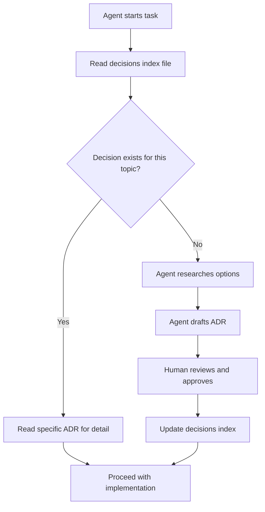

# Technical Strategy: Decide Your Stack Before the Agent Does It for You

Most people skip straight to "build me an app." The agent picks Express because that's what it saw most in training data. Adds Redis because why not. Reaches for Prisma when you already have a perfectly good ORM. Three days later, 15 dependencies you didn't ask for and $50/month in surprise bills.

Write down your technology decisions before any code gets generated. In markdown files the agent reads.

## What Technical Strategy Actually Is

Technical strategy is looking at every dependency in your project and answering three questions:

1. **Why does this exist?** What problem does it solve?
2. **What alternatives did I consider?** Even if the answer is "none, this is obvious."
3. **What are the consequences?** What did I gain, what did I give up?

You're writing Architecture Decision Records (ADRs), a format Michael Nygard proposed in 2011. Each one captures a single decision:

```markdown
# Use PostgreSQL for the Primary Database

## Status
Accepted

## Context
We need a relational database that handles complex queries,
supports JSON columns, and has strong ecosystem support
in our language of choice.

## Decision
Use PostgreSQL. It provides excellent query performance,
native JSON support, and first-class drivers in every
major language. The team has operational experience with it.

## Consequences
- Need to manage schema migrations
- Hosting costs are predictable (no per-query billing)
- Strong local development story (Docker or native install)
- Rules out DynamoDB-style key-value patterns
```

If you've read my [ADR article](/blog/architectural-decision-records), you know why these matter for agents. The short version: an AI agent has no institutional memory. It doesn't know your team tried MongoDB and hated it. ADRs give it that memory.

## Making Decisions: Research, Evaluate, Record

When you need to make a technology decision, here's the process:

1. **Identify the topic.** Look at your stories and architecture. What technology questions remain unanswered? Payment processing? Background jobs? File storage? Search?
2. **Do cursory research.** Not a PhD thesis. Check the package registry, read the README, look at download counts and maintenance activity. 30 minutes, not 3 days.
3. **Evaluate against project needs.** Does it solve your actual problem? Does it play well with your existing stack? Is the maintenance burden reasonable?
4. **Write the ADR.** Include an "Options Considered" section so future-you (or the agent) knows what else was on the table.

```markdown
# Use Oban for Background Jobs

## Status
Accepted

## Context
The application needs reliable background job processing for
email delivery, report generation, and webhook retries.

## Options Considered
- **Oban** - PostgreSQL-backed, Elixir-native, built-in UI
- **Exq** - Redis-backed, similar to Sidekiq
- **GenServer + Task** - No dependencies, but no persistence

## Decision
Use Oban. It uses the existing PostgreSQL database (no Redis),
provides job persistence, retries, scheduling, and a web UI
for monitoring. One fewer infrastructure dependency.

## Consequences
- Job state lives in PostgreSQL (already managed)
- Web UI available for monitoring in development and production
- Must manage Oban migrations alongside app migrations
```

## The Decisions Index

Keep a single file that lists every decision and its status. This is the table of contents the agent scans before diving into individual records.

```markdown
# Technology Decisions

| Topic | Status | File |
|-------|--------|------|
| Elixir | Accepted (pre-made) | decisions/elixir.md |
| Phoenix | Accepted (pre-made) | decisions/phoenix.md |
| LiveView | Accepted (pre-made) | decisions/liveview.md |
| Background Jobs | Accepted | decisions/oban.md |
| Payment Processing | Proposed | decisions/stripe.md |
```

The agent reads this index, knows what's been decided, and can focus on what hasn't.

## How the Agent Uses This

The agent starts a task. Before writing any code, it reads the decisions index file. Not the whole directory. The index is the summary, the table of contents. If it needs detail on a specific decision, it reads that individual ADR.



Use the agent for the research and drafting. It's good at surveying package registries, reading READMEs, comparing options. Have it draft the ADR, then you review and approve. The human decides. The agent does the legwork.

This is the difference between "the agent chose React because it felt like it" and "the agent researched three options, drafted an ADR recommending LiveView, I approved it, and now every future session follows that decision."

## The Real Payoff

Teams who skip technical strategy don't save time. They spend it later debugging dependency conflicts and refactoring choices that were never really choices.

An ADR takes 5 minutes to write. Having the agent research and draft one takes maybe 30 minutes including your review. Rearchitecting because the agent made 20 undocumented choices takes weeks.

Once your technical strategy is in place, the next step is [architecture design](/documentation/architecture-design-guide), where you map stories to components. Technical strategy tells the agent what to build with. Architecture design tells it what to build.

## Do This Today

1. **Create a `decisions/` directory** in your project.
2. **Write ADRs for decisions you've already made.** Language, framework, database, hosting. One markdown file each.
3. **Create an index file.** One markdown table listing every decision and its status. This is what the agent reads first.
4. **Point your agent at the index.** Add to your agent's instructions: "Read the decisions index before making technology choices."
5. **Use the agent for new decisions.** When a new technology question comes up, tell the agent to research options and draft an ADR. Review it, approve it, add it to the index.

You don't need special tooling. A markdown file is enough. The agent reads markdown natively. Structure matters, not the platform.
