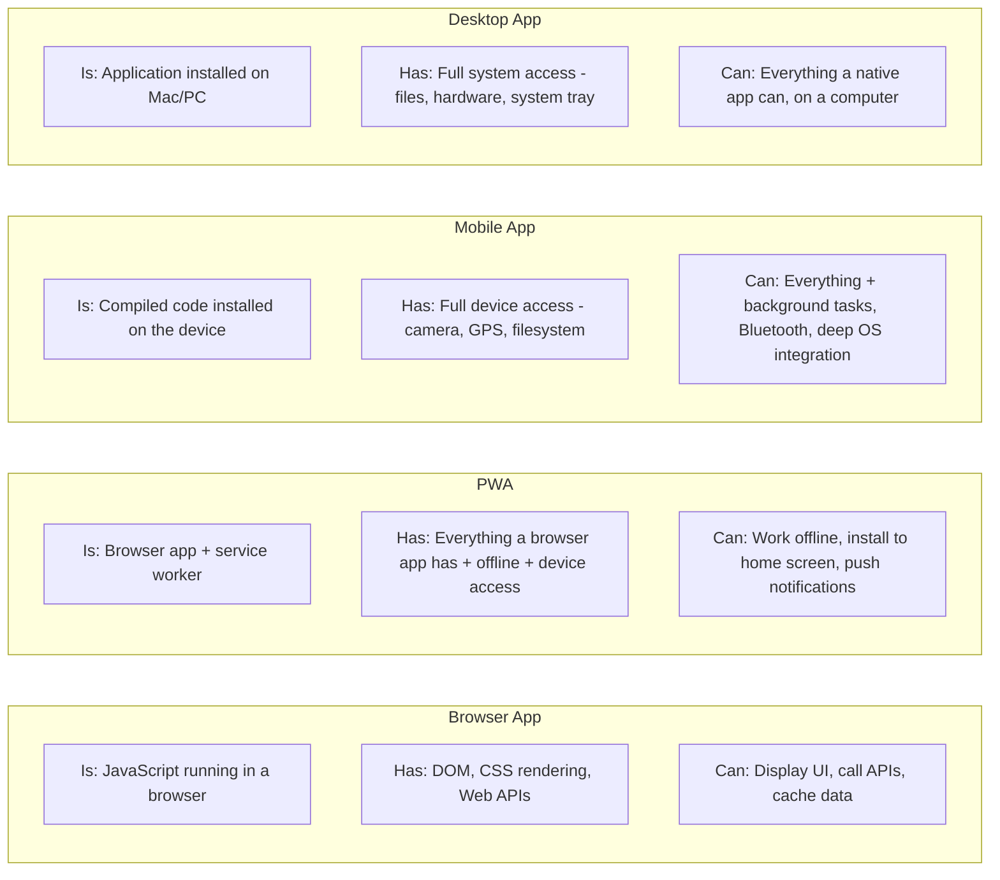

# What Is the Client? (It's More Powerful Than You Think)

> "I basically just describe what I want and somehow end up with working projects"
> -- r/vibecoding

The client is the computer your user is holding. Their phone, their laptop, their browser. It's where your app runs after it leaves the server.

Most vibe coders treat the client like a dumb screen. It's not. And here's what really tripped me up early on: "the client" isn't always a browser. There are a bunch of different kinds of clients, each with different capabilities. Your AI picks one for you and never explains the choice.

## Kinds of Clients

**Browser app** - JavaScript that downloads from the server and runs in the browser. React, Vue, Next.js. User opens a URL, browser downloads the code, it runs. No installation. This is what your AI builds by default.

**Progressive Web App (PWA)** - A browser app with extra powers. Works offline. Can access the camera and GPS. Can be "installed" to the home screen so it looks like a native app. Still browser tech under the hood, just with more access to the device.

**Mobile app (iOS/Android)** - Downloaded from the App Store or Play Store, installed on the device. Full access to everything - camera, GPS, file system, notifications, Bluetooth. Built with React Native, Flutter, or Swift/Kotlin. Different codebase from your website unless you use something like Capacitor to wrap a web app.

**Desktop app** - Installed on a Mac or PC. Full access to the local machine - files, hardware, system tray. VS Code, Cursor, Slack, Discord - all desktop apps built with web technology using Electron or Tauri.

**Thin client** - Does almost nothing locally. Just displays what the server sends. Remote desktop, a basic terminal. Server does all the work.

**Fat client** - Does most of the work locally. Video games, Photoshop, desktop IDEs. The server is just for syncing data or accounts.

Most vibe-coded apps are browser apps. But your AI might suggest React Native for mobile, or Electron for desktop, or Capacitor to turn your web app into a phone app. If you don't know these are different kinds of clients with different tradeoffs, you can't tell whether that's the right call.

## What the Client Can Do

The device is a real computer. Here's what you're leaving on the table if you ignore it:

**Rendering.** Games, charts, animations, image manipulation. The client has a GPU. If your app does anything visual, that work belongs here.

**Offline.** PWAs and native apps can work without internet. If your app could be useful on a plane, client-side logic makes that possible.

**Caching.** Store data the user already fetched. Don't fetch it again. Faster for them, cheaper for you.

**Form handling.** Validation, state, autocomplete - all client until they hit submit. No reason to call the server to tell someone they forgot the @.

**Public API calls.** No secret key needed? The client can call it directly. Weather data, public feeds, map tiles. Skip the server.

**Local storage.** The device has a hard drive. PWAs and native apps can store real data locally. Browser apps get localStorage and IndexedDB.

**Device access.** Camera, microphone, GPS, Bluetooth - native apps and PWAs can tap hardware directly. Browser apps can too, with permission.

## What the Client Cannot Do (Safely)

- **Store secrets.** API keys, tokens, passwords - never. The client is public.
- **Talk directly to your database.** Always go through the server. (Supabase blurs this with Row Level Security, but understand what you're doing.)
- **Be trusted for business logic.** Client calculates a price? User can change it. Client says someone is an admin? User can lie. Server verifies.
- **Protect other users' data.** Server decides who sees what. Client just displays it.

## The "Is A / Has A" for Clients

## What to Tell Your AI

> "What kind of client are we building? Browser app, PWA, mobile app, or desktop app? What are the tradeoffs for my use case?"

Your AI defaults to a browser app. That might be right. But if your users need offline access, or you want the App Store, or you need file system access, you need a different kind of client. Ask before it builds.

> "What work is happening on the client vs the server? Could we move more to the client to make it faster?"

If every button click calls the server, your app feels slow. A lot of that work can run on the client. Your AI won't optimize for this unless you ask.
