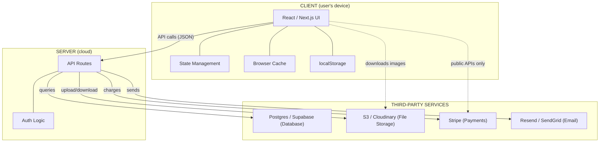

# What Is It and Where Does It Belong?

> Does the toilet belong in the bathroom or the living room?

Obvious, right? But your AI does the equivalent of putting a toilet in the living room constantly. It puts things in the wrong place because you didn't tell it where they belong. And if you don't know the difference, you won't catch it.

The most useful question you can ask about anything in your app: **what is it, and where does it belong?**

## The Toilet Test

You know what the client is and what the server is from the previous articles. Now the question is: for any given feature, which one does it belong on?

Two questions:

1. **Does it need to be private?** Server. The client is public.
2. **Does it need to be fast?** Client. Every server call has a delay.

The obvious ones:

- **Passwords** - server. The toilet goes in the bathroom.
- **Button animations** - client. You don't call the server to make a button wiggle.
- **Credit card processing** - server (Stripe's server, specifically). Never the client.
- **Form validation** ("is this a valid email?") - client. Why make the user wait for a round-trip to tell them they forgot the @?

The less obvious ones:

- **Images** - stored on the server (or S3), but downloaded to the client and rendered there. The client's GPU does the pixel work.
- **Search** - depends. Small dataset? Filter on the client, it's instant. Big dataset? Server.
- **Auth state** ("is this user logged in?") - server decides, client remembers for the session.

## Where Your Services Belong

**S3 (Cloudinary, UploadThing)** is file storage. Server. Files upload through the server (to check permissions), get stored on S3, and the client downloads them to display. Your AI might set up direct client-to-S3 uploads - that works but it means the client has upload credentials.

**Supabase** is a database + auth service. Should be server. But Supabase is sneaky - it's designed for the client to talk to it directly using Row Level Security rules. It's a toilet in the hallway. Technically functional, but you better have good locks.

**Stripe** is payment processing. Stripe's server. Your server talks to Stripe, the client never sees payment details. Your AI almost never gets this one wrong.

**localStorage** is browser storage. It's ON the client. But people store sensitive things in it. Don't. Any JavaScript on the page can read it.

**WebSockets** are a persistent connection between client and server. Both. That's the point - real-time features like chat and live updates need the server to push data to the client without being asked.

## The Diagnostic

When your app is **slow**: "Is this making a server call when it could run on the client?"

When your app **leaks data**: "Is this on the client when it should be on the server?"

When your app is **expensive**: "Is this hitting the server every interaction when it could cache on the client?"

Most problems in vibe-coded apps come down to things in the wrong place.

## What to Tell Your AI

> "For this feature, should the logic run on the client or the server? What are the tradeoffs?"

Forces your AI to explain its choice so you can catch it when it's wrong.

> "What data is the client sending to the server, and what is the server sending to the client? Is any of it sensitive?"

If the server is sending other users' data to the client, or API keys are in the client code, you've got a toilet in the living room.

## If You're Still Here: The Typical Layout of a Web App

Here's what a typical vibe-coded app actually looks like when you lay out where everything lives.

Reading this diagram:

**The client** has your React app, state management, browser cache, and localStorage. This is everything running on the user's device. It renders the UI and handles interactions.

**The server** has your API routes and auth logic. This is the middleman. Every request from the client goes through here. The server checks who's asking, decides if they're allowed, and then talks to the services.

**Third-party services** are where your data actually lives. The database stores your records. S3 stores your files. Stripe handles money. Email services send notifications. Your server talks to all of these - the client almost never talks to them directly.

The dotted lines are the exceptions. The client can download images directly from S3 (that's fine, images are public). The client can talk to Stripe's public-facing JavaScript for payment forms (Stripe designed it that way). But the actual charges, the database queries, the email sends - those all go through your server.

If your AI set something up and you're not sure where it belongs, find it on this diagram. If it's crossing a line that isn't drawn here, ask your AI why.
