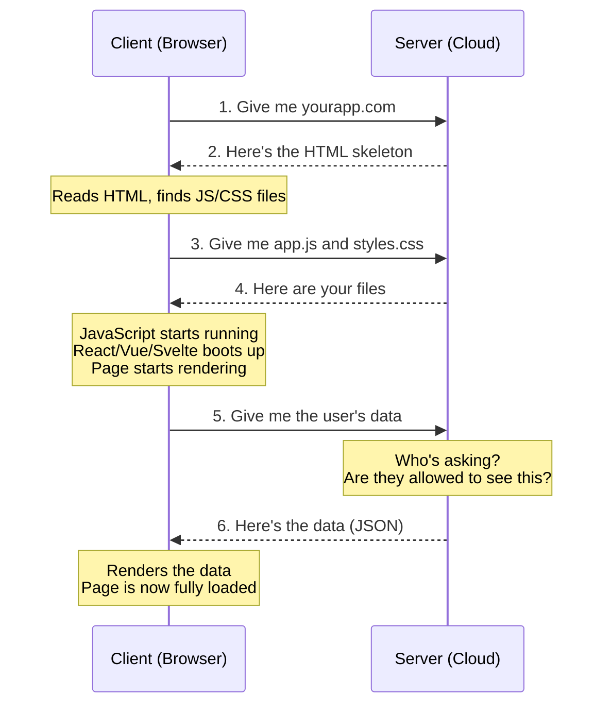

# Your App Has Two Halves and You Need to Know Which Is Which

> "Vibe code so hard your entire waitlist is visible in frontend"
> -- r/vibecoding, 608 upvotes

When I first started writing software, I spun up a Django app and everything was going fine. Then at some point I needed JavaScript to do something on the page. And I didn't understand that I had crossed a line. I was no longer writing code that ran on the server. I was writing code that ran in the browser.

Because I always try to do complicated things, that led me to build a whole Vue app. And I just had no idea that what Vue was actually doing was bundling up a bunch of JavaScript, downloading it into the browser, and running it there. On the user's computer. Not on mine.

It took me a while to pick those two things apart. And once I did, a ton of stuff that had been confusing suddenly made sense. That's why I wanted to write this. If you're vibe coding right now and things feel weirdly broken in ways you can't explain, there's a decent chance this is why.

## The Two Halves: Client and Server

Your app has two parts that run on two completely different computers:

**The client** is the user's device - their browser, their phone, their laptop. It's the stuff people see and click on. Buttons, forms, images, text, animations. When your AI writes React or Vue or Svelte code, that code gets downloaded to the user's device and runs there. You'll also hear this called the "frontend."

**The server** is a computer somewhere else, in the cloud. It's the stuff that happens behind the scenes. Saving data, checking passwords, processing payments, talking to other services. When your AI writes code that talks to Supabase or handles login, that's server code. You'll also hear this called the "backend."

Here's why this matters: **the client is public.** Anything that runs on the user's device is visible to anyone who knows how to look. And "knowing how to look" means right-clicking and choosing "Inspect." That's it.

This is how someone's entire waitlist ended up visible on the client. The AI put the data in the browser code instead of keeping it on the server. The app looked fine. It worked fine. But anyone who opened DevTools could see every email address. 608 people upvoted that post because it scared them.

## How to Tell Which Half You're Looking At

This was the thing that tripped me up with Django and Vue. I was writing code in the same editor, in the same project folder, sometimes in files right next to each other. Nothing screamed "hey, you just switched from backend to frontend."

But there are clues:

**Client code** (runs on the user's device):
- Files in folders called `components`, `pages`, `app`, `views`, `src`
- Anything with React, Vue, Svelte, or Next.js components
- Code that makes things appear on screen, handles clicks, shows/hides stuff
- Anything the user directly interacts with

**Server code** (runs in the cloud):
- API routes, server actions, edge functions
- Anything that talks directly to a database
- Code that checks passwords or handles login
- Code that uses API keys or secrets
- Files in folders called `api`, `server`, `functions`, `routes`

**The confusing part:** frameworks like Next.js blur the line on purpose. Some files run on the server. Some run on the client. Some run in both places. This is genuinely confusing and it trips up actual developers too, so don't feel dumb about it.

## Why Your Data Leaked

Now you can understand the waitlist thing. Here's what happened:

1. Someone told their AI to "show the waitlist signups on the admin page"
2. The AI fetched ALL the signups and sent them to the frontend
3. The frontend displayed them on screen
4. But the data was also sitting right there in the browser's memory, visible to anyone

The fix is conceptually simple: the backend should check who's asking before it sends data. And it should only send the data that person is allowed to see. This is called "authorization" and your AI probably skipped it because you didn't ask for it.

This same pattern causes most security problems in vibe-coded apps:
- API keys in client code (anyone can steal them and run up your bill)
- Database queries in client code (anyone can see or modify your data)
- Admin features that only check "is this the admin page?" instead of "is this person actually an admin?"

The rule is dead simple: **anything secret or sensitive has to stay on the server.** If it's on the client, assume everyone in the world can see it.

## What This Means for Your Stack

Remember the "is a / has a" breakdown from the last article? Now you can sort those pieces into halves:

**Client (runs on the user's device):**
- React, Vue, Svelte - these build what people see
- Tailwind - makes it look good
- Next.js - does both, which is why it's confusing

**Server (runs in the cloud):**
- Supabase, Firebase - stores your data and handles login
- Stripe - processes payments
- Your API routes - the middleman between client and server

**Infrastructure (makes it all work):**
- Vercel, Netlify - hosts your client code (and sometimes your server code)
- GitHub - stores your code
- npm - downloads libraries

When something breaks, the first question is always: is this a client problem or a server problem? Is the broken thing running on the user's device, or in the cloud?

## What to Tell Your AI

Two prompts that will save you:

> "Is this code running on the client or the server? I need to know which half of the app we're working on."

Ask this whenever your AI is writing something and you're not sure where it runs. Especially with Next.js, where the answer isn't always obvious.

> "Are there any API keys, secrets, or user data in the client code? List anything that should be moved to the server."

Run this as a check-up on any project. I've seen experienced developers accidentally ship API keys in client code. For vibe coders who don't know the difference between the two halves, it happens constantly.

The whole point isn't to become a security expert. It's to know that the line exists, and to know which side of it your stuff should be on.

## If You're Still Here: How a Page Load Actually Works

Here's what happens when someone visits your app. Every single time.

Step by step:

1. **Browser sends a request.** You typed a URL or clicked a link. The browser asks the server for the page.

2. **Server sends back HTML.** This is the skeleton - the bare structure of the page. It's mostly empty. But it includes links to JavaScript and CSS files.

3. **Browser requests the JavaScript and CSS.** It reads the HTML, sees "you'll need app.js and styles.css," and asks the server for those too.

4. **Server sends the files.** Now the browser has everything it needs to run the app.

5. **JavaScript starts running on the client.** This is where React or Vue or whatever framework your AI chose boots up. It starts rendering the page - building the buttons, the layout, the navigation. But it doesn't have any data yet. So it calls the server: "give me this user's profile" or "give me the list of products."

6. **Server sends back data.** Usually as JSON (basically a structured text format). The JavaScript takes that data and renders it on screen. Now the page is fully loaded.

This is why your app sometimes shows a blank page or a loading spinner for a second before content appears. Steps 1-4 are the app loading. Steps 5-6 are the data loading. They're separate trips to the server.

It's also why your app can feel broken even when the code is fine - if step 5 fails (bad API call, server down, wrong permissions), the page loads but the data never shows up. The client half works. The server half didn't.
