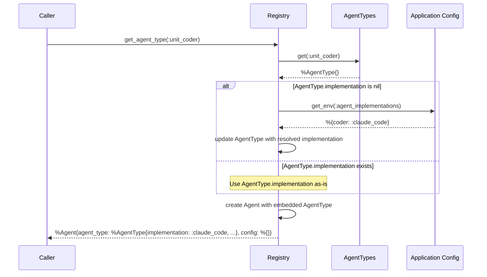

# Registry

## Purpose
Agent factory that creates Agent structs with embedded AgentType information. Handles implementation resolution when AgentType doesn't specify one.

## Module Interface

```elixir
@spec get_agent(agent_type(), map()) :: {:ok, Agent.t()} | {:error, :unknown_type}
@spec list_agent_types() :: [agent_type()]

@type agent_type() :: :unit_coder
```

## Function Specifications

### `get_agent/2`
Creates an Agent struct with provided config by:
1. Getting AgentType data from AgentTypes module
2. Resolving implementation if AgentType.implementation is nil
3. Embedding complete AgentType with resolved implementation in Agent struct
4. Setting config in Agent.config for final configuration

### `list_agents/0`
Returns list of all available agent types from AgentTypes module.

## Sequence Diagram



### Implementation Resolution Priority
1. **AgentType.implementation**: If type specifies an implementation atom, use it
2. **Global implementation config**: If AgentType.implementation is nil, resolve from application config

## Dependencies

- **AgentTypes**: For agent type data lookup
- **Agent**: Embedded schema with AgentType
- **Application Configuration**: For implementation resolution when not specified by type
