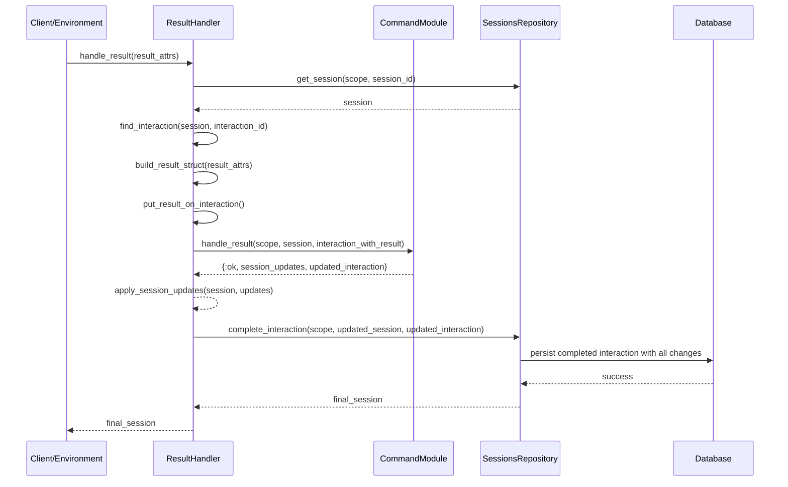

# Result Handler Design

## Purpose

The ResultHandler module coordinates the processing of command execution results from external environments (VS Code, CLI, etc.). It acts as the bridge between raw result data and the domain model, ensuring results are properly validated and integrated into the session state. The handler follows a "process first, then persist" approach - allowing command modules to process results and return session updates, then handling all persistence operations atomically. This ensures clean separation of concerns while maintaining system reliability.

## Public API

```elixir
# Main entry point - processes a result from command execution
# Returns {:ok, final_session} or {:error, reason}
def handle_result(scope, session_id, interaction_id, result_attrs)
```

## Execution Flow

Client/Environment → ResultHandler → CommandModule → SessionsRepository → Database

1. Client executes command, returns result_attrs
2. ResultHandler.handle_result/4 called
3. Convert result_attrs to Result domain struct
4. Create in-memory interaction with result attached
5. Call command module's handle_result/3 with domain objects
6. Command module processes result, returns session updates (and optionally result override)
7. Apply session updates and final result to session
8. Persist completed interaction with all changes in single atomic operation
9. Return final persisted session



## Command Module Responsibilities

Command modules should return session updates instead of handling persistence:

```elixir
@callback handle_result(scope :: Scope.t(), session :: Session.t(), interaction :: Interaction.t()) ::
  {:ok, session_updates :: map()} |
  {:ok, session_updates :: map(), result_override :: map()} |
  {:error, reason :: String.t()}
```

**Examples:**
```elixir
# Simple case - just update session state
{:ok, %{state: new_state}}

# Complex case - update session state AND override result (for validation errors)
{:ok, %{state: current_state}, %{status: :error, stderr: "Validation failed"}}
```

**Key Principles:**
- Command modules never directly persist anything
- Command modules work with pure domain objects
- Command modules return declarative updates
- Result handler handles all persistence atomically
- Single database write per interaction
- Clean separation: command modules = domain logic, result handler = persistence orchestration