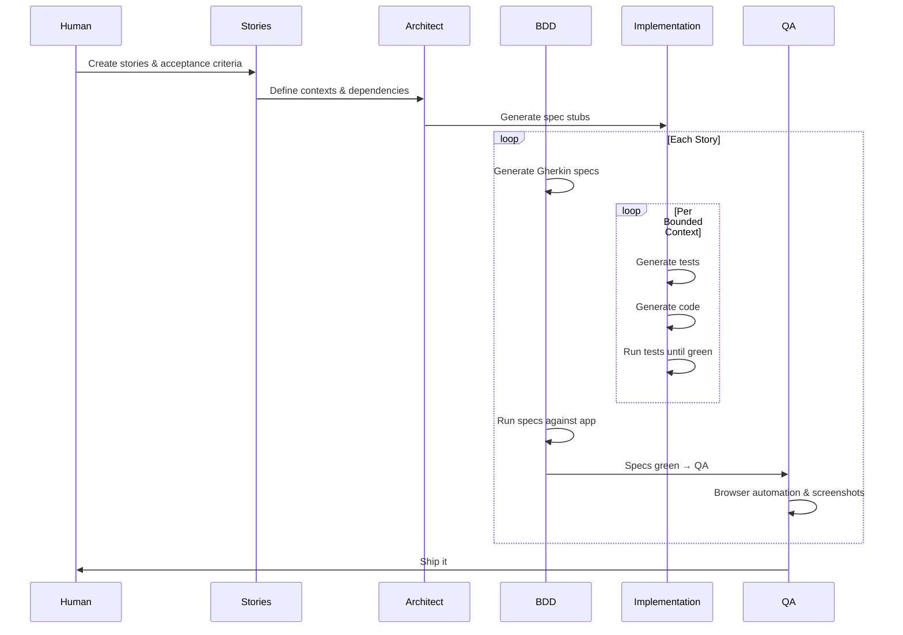

# CodeMySpec Methodology Flow

## Sequence Diagram

## Key Insight

The old methodology page only covered the Implementation self-loops (specs → tests → code → green). The real process:

- **Stories** define what "done" looks like (acceptance criteria)
- **Architect** scaffolds the structure once upfront
- **BDD** bookends each story — generate specs before, verify after
- **Implementation** operates per bounded context within each story
- **QA** is the final gate — browser automation against the running app
- **Feedback** from any gate routes back to the appropriate level

## Grain

- BDD specs and QA operate at the **story** level (does this feature work for the user?)
- Design, code, and tests operate at the **bounded context** level (does this module work correctly?)
