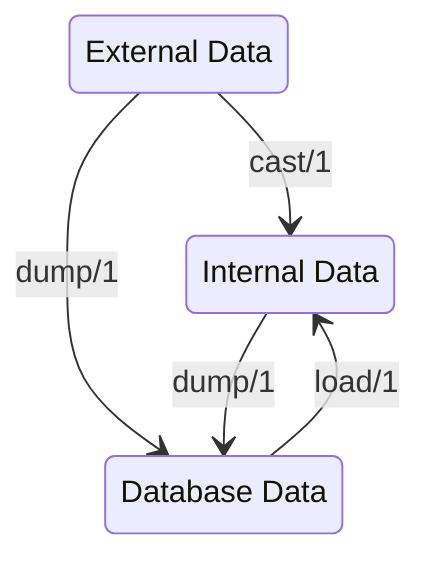

# Ecto.Type

Defines functions and the `Ecto.Type` behaviour for implementing
basic custom types.

Ecto provides two types of custom types: basic types and
parameterized types. Basic types are simple, requiring only four
callbacks to be implemented, and are enough for most occasions.
Parameterized types can be customized on the field definition and
provide a wide variety of callbacks.

The definition of basic custom types and all of their callbacks are
available in this module. You can learn more about parameterized
types in `Ecto.ParameterizedType`. If in doubt, prefer to use
basic custom types and rely on parameterized types if you need
the extra functionality.

## External vs internal vs database representation

The core functionality of a custom type is the mapping between
external, internal and database representations of a value belonging
to the type.

For a definition of external and internal data take a look at the
[related section](`Ecto.Changeset#module-external-vs-internal-data`)
in the changeset documentation.

## Example

Imagine you want to store a URI struct as part of a schema in a
url-shortening service. There isn't an Ecto field type to support
that value at runtime therefore a custom one is needed.

You also want to query not only by the full url, but for example
by specific ports used. This is possible by putting the URI data
into a map field instead of just storing the plain
string representation.

    from s in ShortUrl,
      where: fragment("?->>? ILIKE ?", s.original_url, "port", "443")

So the custom type does need to handle the conversion from
external data to runtime data (`c:cast/1`) as well as
transforming that runtime data into the `:map` Ecto native type and
back (`c:dump/1` and `c:load/1`).

    defmodule EctoURI do
      use Ecto.Type
      def type, do: :map

      # Provide custom casting rules.
      # Cast strings into the URI struct to be used at runtime
      def cast(uri) when is_binary(uri) do
        {:ok, URI.parse(uri)}
      end

      # Accept casting of URI structs as well
      def cast(%URI{} = uri), do: {:ok, uri}

      # Everything else is a failure though
      def cast(_), do: :error

      # When loading data from the database, as long as it's a map,
      # we just put the data back into a URI struct to be stored in
      # the loaded schema struct.
      def load(data) when is_map(data) do
        data =
          for {key, val} <- data do
            {String.to_existing_atom(key), val}
          end
        {:ok, struct!(URI, data)}
      end

      # When dumping data to the database, we *expect* a URI struct
      # but any value could be inserted into the schema struct at runtime,
      # so we need to guard against them.
      def dump(%URI{} = uri), do: {:ok, Map.from_struct(uri)}
      def dump(_), do: :error
    end

Now we can use our new field type above in our schemas:

    defmodule ShortUrl do
      use Ecto.Schema

      schema "posts" do
        field :original_url, EctoURI
      end
    end

Note: `nil` values are always bypassed and cannot be handled by
custom types.

> #### `use Ecto.Type` {: .info}
>
> When you `use Ecto.Type`, it will set `@behaviour Ecto.Type` and define
> default, overridable implementations for `c:embed_as/1` and `c:equal?/2`.
> You must implement your own `c:embed_as/1` function if you want
> your `c:dump/1` to be called when exporting from Ecto.

## Custom types and primary keys

Remember that, if you change the type of your primary keys,
you will also need to change the type of all associations that
point to said primary key.

Imagine you want to encode the ID so they cannot enumerate the
content in your application. An Ecto type could handle the conversion
between the encoded version of the id and its representation in the
database. For the sake of simplicity, we'll use base64 encoding in
this example:

    defmodule EncodedId do
      use Ecto.Type

      def type, do: :id

      def cast(id) when is_integer(id) do
        {:ok, encode_id(id)}
      end
      def cast(_), do: :error

      def dump(id) when is_binary(id) do
        {:ok, id_decoded} = Base.decode64(id)
        {:ok, String.to_integer(id_decoded)}
      end

      def load(id) when is_integer(id) do
        {:ok, encode_id(id)}
      end

      defp encode_id(id) do
        id
        |> Integer.to_string()
        |> Base.encode64()
      end
    end

To use it as the type for the id in our schema, we can use the
`@primary_key` module attribute:

    defmodule BlogPost do
      use Ecto.Schema

      @primary_key {:id, EncodedId, autogenerate: true}
      schema "posts" do
        belongs_to :author, Author, type: EncodedId
        field :content, :string
      end
    end

    defmodule Author do
      use Ecto.Schema

      @primary_key {:id, EncodedId, autogenerate: true}
      schema "authors" do
        field :name, :string
        has_many :posts, BlogPost
      end
    end

The `@primary_key` attribute will tell ecto which type to
use for the id.

Note the `type: EncodedId` option given to `belongs_to` in
the `BlogPost` schema. By default, Ecto will treat
associations as if their keys were `:integer`s. Our primary
keys are a custom type, so when Ecto tries to cast those
ids, it will fail.

Alternatively, you can set `@foreign_key_type EncodedId`
after `@primary_key` to automatically configure the type
of all `belongs_to` fields.

## base?(atom)

Checks if the given atom can be used as base type.

    iex> base?(:string)
    true
    iex> base?(:array)
    false
    iex> base?(Custom)
    false

## cast(type, value)

Casts a value to the given type.

`cast/2` is used by the finder queries and changesets to cast outside values to
specific types.

Note that nil can be cast to all primitive types as data stores allow nil to be
set on any column.

NaN and infinite decimals are not supported, use custom types instead.

    iex> cast(:any, "whatever")
    {:ok, "whatever"}

    iex> cast(:any, nil)
    {:ok, nil}
    iex> cast(:string, nil)
    {:ok, nil}

    iex> cast(:integer, 1)
    {:ok, 1}
    iex> cast(:integer, "1")
    {:ok, 1}
    iex> cast(:integer, "1.0")
    :error

    iex> cast(:id, 1)
    {:ok, 1}
    iex> cast(:id, "1")
    {:ok, 1}
    iex> cast(:id, "1.0")
    :error

    iex> cast(:float, 1.0)
    {:ok, 1.0}
    iex> cast(:float, 1)
    {:ok, 1.0}
    iex> cast(:float, "1")
    {:ok, 1.0}
    iex> cast(:float, "1.0")
    {:ok, 1.0}
    iex> cast(:float, "1-foo")
    :error

    iex> cast(:boolean, true)
    {:ok, true}
    iex> cast(:boolean, false)
    {:ok, false}
    iex> cast(:boolean, "1")
    {:ok, true}
    iex> cast(:boolean, "0")
    {:ok, false}
    iex> cast(:boolean, "whatever")
    :error

    iex> cast(:string, "beef")
    {:ok, "beef"}
    iex> cast(:binary, "beef")
    {:ok, "beef"}

    iex> cast(:decimal, Decimal.new("1.0"))
    {:ok, Decimal.new("1.0")}
    iex> cast(:decimal, "1.0bad")
    :error

    iex> cast({:array, :integer}, [1, 2, 3])
    {:ok, [1, 2, 3]}
    iex> cast({:array, :integer}, ["1", "2", "3"])
    {:ok, [1, 2, 3]}
    iex> cast({:array, :string}, [1, 2, 3])
    :error
    iex> cast(:string, [1, 2, 3])
    :error

    iex> cast(:utc_datetime, "2014-04-17T14:00:00Z")
    {:ok, ~U[2014-04-17 14:00:00Z]}
    iex> cast(:utc_datetime, "2014-04-17T14:00:00.030Z")
    {:ok, ~U[2014-04-17 14:00:00Z]}
    iex> cast(:utc_datetime, "2014-04-17T12:00:00-02:00")
    {:ok, ~U[2014-04-17 14:00:00Z]}

## cast!(type, value)

Casts a value to the given type or raises an error.

See `cast/2` for more information.

## Examples

    iex> Ecto.Type.cast!(:integer, "1")
    1
    iex> Ecto.Type.cast!(:integer, 1)
    1
    iex> Ecto.Type.cast!(:integer, nil)
    nil

    iex> Ecto.Type.cast!(:integer, 1.0)
    ** (Ecto.CastError) cannot cast 1.0 to :integer

## composite?(atom)

Checks if the given atom can be used as composite type.

    iex> composite?(:array)
    true
    iex> composite?(:string)
    false

## dump(type, value, dumper \\ &dump/2)

Dumps a value to the given type.

Opposite to casting, dumping requires the returned value
to be a valid Ecto type, as it will be sent to the
underlying data store.

    iex> dump(:string, nil)
    {:ok, nil}
    iex> dump(:string, "foo")
    {:ok, "foo"}

    iex> dump(:integer, 1)
    {:ok, 1}
    iex> dump(:integer, "10")
    :error

    iex> dump(:binary, "foo")
    {:ok, "foo"}
    iex> dump(:binary, 1)
    :error

    iex> dump({:array, :integer}, [1, 2, 3])
    {:ok, [1, 2, 3]}
    iex> dump({:array, :integer}, [1, "2", 3])
    :error
    iex> dump({:array, :binary}, ["1", "2", "3"])
    {:ok, ["1", "2", "3"]}

## embed_as(base, format)

Gets how the type is treated inside embeds for the given format.

See `c:embed_as/1`.

## embedded_dump(type, value, format)

Dumps the `value` for `type` considering it will be embedded in `format`.

## Examples

    iex> Ecto.Type.embedded_dump(:decimal, Decimal.new("1"), :json)
    {:ok, Decimal.new("1")}

## embedded_load(type, value, format)

Loads the `value` for `type` considering it was embedded in `format`.

## Examples

    iex> Ecto.Type.embedded_load(:decimal, "1", :json)
    {:ok, Decimal.new("1")}

## equal?(type, term1, term2)

Checks if two terms are equal.

Depending on the given `type` performs a structural or semantical comparison.

## Examples

    iex> equal?(:integer, 1, 1)
    true
    iex> equal?(:decimal, Decimal.new("1"), Decimal.new("1.00"))
    true

## format(type)

Format type for error messaging and logs.

## include?(type, term, collection)

Checks if `collection` includes a `term`.

Depending on the given `type` performs a structural or semantical comparison.

## Examples

    iex> include?(:integer, 1, 1..3)
    true
    iex> include?(:decimal, Decimal.new("1"), [Decimal.new("1.00"), Decimal.new("2.00")])
    true

## load(type, value, loader \\ &load/2)

Loads a value with the given type.

    iex> load(:string, nil)
    {:ok, nil}
    iex> load(:string, "foo")
    {:ok, "foo"}

    iex> load(:integer, 1)
    {:ok, 1}
    iex> load(:integer, "10")
    :error

## match?(schema_type, query_type)

Checks if a given type matches with a primitive type
that can be found in queries.

    iex> match?(:string, :any)
    true
    iex> match?(:any, :string)
    true
    iex> match?(:string, :string)
    true

    iex> match?({:array, :string}, {:array, :any})
    true

    iex> match?(Ecto.UUID, :uuid)
    true
    iex> match?(Ecto.UUID, :string)
    false

## parameterized?(arg1, module)

Checks if the given type is parameterized by the given module.

    iex> type = Ecto.ParameterizedType.init(Ecto.Enum, values: [a: 1])
    iex> Ecto.Type.parameterized?(type, Ecto.Enum)
    true
    iex> Ecto.Type.parameterized?(type, MyEnum)
    false

## primitive?(base)

Checks if we have a primitive type.

    iex> primitive?(:string)
    true
    iex> primitive?(Another)
    false

    iex> primitive?({:array, :string})
    true
    iex> primitive?({:array, Another})
    true

## type(type)

Retrieves the underlying schema type for the given, possibly custom, type.

    iex> type(:string)
    :string
    iex> type(Ecto.UUID)
    :uuid

    iex> type({:array, :string})
    {:array, :string}
    iex> type({:array, Ecto.UUID})
    {:array, :uuid}

    iex> type({:map, Ecto.UUID})
    {:map, :uuid}

## autogenerate/0

Generates a loaded version of the data.

This is callback is invoked when a custom type is given
to `field` with the `:autogenerate` flag.

## cast/1

Casts the given input to the custom type.

This callback is called on external input and can return any type,
as long as the `dump/1` function is able to convert the returned
value into an Ecto native type. There are two situations where
this callback is called:

  1. When casting values by `Ecto.Changeset`
  2. When passing arguments to `Ecto.Query`

You can return `:error` if the given term cannot be cast.
A default error message of "is invalid" will be added to the
changeset.

You may also return `{:error, keyword()}` to customize the
changeset error message and its metadata. Passing a `:message`
key, will override the default message. It is not possible to
override the `:type` key.

For `{:array, CustomType}` or `{:map, CustomType}` the returned
keyword list will be erased and the default error will be shown.

## dump/1

Dumps the given term into an Ecto native type.

This callback is called with any term that was stored in the struct
and it needs to validate them and convert it to an Ecto native type.

## embed_as/1

Dictates how the type should be treated inside embeds.

By default, the type is sent as itself, without calling
dumping to keep the higher level representation. But
it can be set to `:dump` so that it is dumped before
being encoded.

## equal?/2

Checks if two terms are semantically equal.

This callback is used for determining equality of types in
`Ecto.Changeset`.

By default the terms are compared with the equal operator `==/2`.

## load/1

Loads the given term into a custom type.

This callback is called when loading data from the database and
receives an Ecto native type. It can return any type, as long as
the `dump/1` function is able to convert the returned value back
into an Ecto native type.

## type/0

Returns the underlying schema type for the custom type.

For example, if you want to provide your own date
structures, the type function should return `:date`.

Note this function is not required to return Ecto primitive
types, the type is only required to be known by the adapter.

## t/0

An Ecto type, primitive or custom.

## primitive/0

Primitive Ecto types (handled by Ecto).

## custom/0

Custom types are represented by user-defined modules.