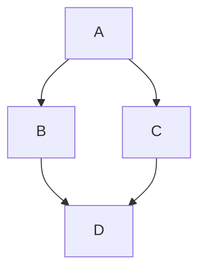

# MDExMermaid

[MDEx](https://mdelixir.dev) plugin for [Mermaid](https://mermaid.js.org).

## Usage

````elixir
Mix.install([
  {:mdex_mermaid, "~> 0.1"}
])

markdown = """
# Flowchart


"""

mdex = MDEx.new(markdown: markdown) |> MDExMermaid.attach()

MDEx.to_html!(mdex) |> IO.puts()
#=>
# <script type="module">
#   import mermaid from 'https://cdn.jsdelivr.net/npm/mermaid@11/dist/mermaid.esm.min.mjs';
#   const theme = window.matchMedia && window.matchMedia('(prefers-color-scheme: dark)').matches ? 'dark' : 'default';
#   mermaid.initialize({securityLevel: 'loose', theme: theme});
# </script>
# <h1>Flowchart</h1>
# <pre id="mermaid-1" class="mermaid" phx-update="ignore">graph TD;
#     A-->B;
#     A-->C;
#     B-->D;
#     C-->D;
# </pre>
````

See [attach/2](https://hexdocs.pm/mdex_mermaid/MDExMermaid.html#attach/2) for more info.

## attach(document, options \\ [])

Attaches the MDExMermaid plugin into the MDEx document.

- Mermaid is loaded from https://www.jsdelivr.com/package/npm/mermaid
- Theme is determined by the user's `prefers-color-scheme` system preference

## Options
  - `:mermaid_pre_attrs` (`t:mermaid_pre_attrs/0`) - Function that generates the `<pre>` tag attributes for mermaid code blocks.
  - `:mermaid_init` (`t:String.t/0`) - The HTML tag(s) to inject into the document to initialize mermaid. If `nil`, the default script is used (see below).

### :mermaid_pre_attrs

Whenever a code block tagged as `mermaid` is found, it gets converted into a `<pre>` tag using the following function to generate its attributes:


    pre_attrs = fn seq -> ~s(id="mermaid-#{seq}" class="mermaid" phx-update="ignore") end
    mdex = MDEx.new() |> MDExMermaid.attach(mermaid_pre_attrs: pre_attrs)

Which results in:

    <pre id="mermaid-1" class="mermaid" phx-update="ignore">
      flowchart LR
        ...
    </pre>

You can override it to include or manipulate the attributes but it's important to maintain unique IDs for each instance,
otherwise the mermaid rendering will not work correctly, for eg:

    fn seq -> ~s(id="mermaid-#{seq}" class="mermaid graph" phx-hook="MermaidHook" phx-update="ignore") end

### :mermaid_init

The option `:mermaid_init` can be used to manipulate how mermaid is initialized. By default, the following script is injected into the top of the document:

```html
<script type="module">
  import mermaid from "https://cdn.jsdelivr.net/npm/mermaid@11/dist/mermaid.esm.min.mjs";
  const theme = window.matchMedia && window.matchMedia("(prefers-color-scheme: dark)").matches ? "dark" : "default";
  mermaid.initialize({securityLevel: "loose", theme: theme});
</script>
```

That script works well on static documents but you'll need to adjust it to initialize mermaid in environments
that requires waiting for the DOM to be ready.

## Examples

## DOMContentLoaded

    @mermaid_init """
    <script defer src="https://cdn.jsdelivr.net/npm/mermaid@11/dist/mermaid.esm.min.mjs"></script>
    <script>
      document.addEventListener("DOMContentLoaded", () => {
        const theme = window.matchMedia && window.matchMedia("(prefers-color-scheme: dark)").matches ? "dark" : "default";
        mermaid.initialize({securityLevel: "loose", theme: theme});
    </script>
    """

    mdex = MDEx.new() |> MDExMermaid.attach(mermaid_init: @mermaid_init)

## Phoenix LiveView

To use MDExMermaid with Phoenix LiveView, you can:

1. Load Mermaid (via CDN or npm)
2. Create a LiveView hook to render diagrams
3. Configure MDExMermaid with the appropriate attributes

### Option 1: Using CDN

In your layout:

```html
<script type="module">
  import mermaid from 'https://cdn.jsdelivr.net/npm/mermaid@11/dist/mermaid.esm.min.mjs';
  const theme = window.matchMedia && window.matchMedia('(prefers-color-scheme: dark)').matches ? 'dark' : 'default';
  mermaid.initialize({ startOnLoad: false, securityLevel: 'loose', theme: theme });
  window.mermaid = mermaid;
</script>
```

### Option 2: Using npm

Install Mermaid as a dependency:

```bash
cd assets && npm install mermaid
```

In your `assets/js/app.js`:

```javascript
import mermaid from 'mermaid'

const theme = window.matchMedia && window.matchMedia('(prefers-color-scheme: dark)').matches ? 'dark' : 'default';

mermaid.initialize({ 
  startOnLoad: false, 
  securityLevel: 'loose',
  theme: theme,
})

let hooks = {
  MermaidHook: {
    mounted() {
      mermaid.run({
        querySelector: '.mermaid'
      });
    }
  }
}

let liveSocket = new LiveSocket("/live", Socket, {params: {_csrf_token: csrfToken}, hooks: hooks})
```

### Using in LiveView

```elixir
html =
  MDEx.new(markdown: markdown)
  |> MDExMermaid.attach(
    mermaid_init: "", # already initialized
    mermaid_pre_attrs: fn seq ->
      ~s(id="mermaid-#{seq}" class="mermaid" phx-hook="MermaidHook" phx-update="ignore")
    end
  )
  |> MDEx.to_html!()

assign(socket, html: {:safe, html})}
```

Note that you can attach a JS hook per diagram or in a parent element to handle all diagrams at once, depending on your needs.

See this [LiveView example](https://github.com/leandrocp/mdex_mermaid/blob/main/examples/live_view.exs)