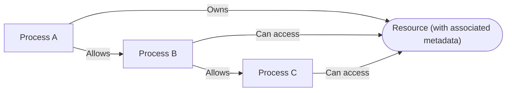

# NimbleOwnership

Module that allows you to manage ownership of resources across processes.

The idea is that you can track ownership of terms (keys) across processes,
and allow processes to use a key through processes that are already allowed.

A typical use case for such a module is tracking resource ownership across processes
in order to isolate access to resources in **test suites**. For example, the
[Mox][mox] library uses this module to track ownership
of mocks across processes (in shared mode).

## Usage

To track ownership of resources, you need to start a `NimbleOwnership` server (a process),
through `start_link/1` or `child_spec/1`.

Then, you can allow a process access to a key through `allow/4`. You can then check
if a PID can access the given key through `fetch_owner/3`.

### Metadata

You can store arbitrary metadata (`t:metadata/0`) alongside each **owned resource**.
This metadata is returned together with the owner PID when you call `fetch_owner/3`.

## Modes

The ownership server can be in one of two modes:

  * **private** (the default): in this mode, you can only allow access to a key through
    the owner PID or PIDs that are already allowed to access the key. You can allow PIDs
    through `allow/4`. This mode is useful when you want to track ownership of resources
    in concurrent environments (such as in a test suite).

  * **shared**: in this mode, there is only one *shared owner PID* that owns all the keys
    in the ownership server. Any other PID can read the metadata associated with any key,
    but it cannot update the metadata (only the shared owner can).

> #### Returning to Private Mode {: .warning}
>
> If the ownership server is in *shared mode* and the shared owner process terminates,
> the server automatically returns to *private mode*.

## Cleanup

When an owner PID goes down, the ownership server automatically cleans up all the
allowances and owned keys associated with that owner PID. If you want to **manually**
clean up the allowances and owned keys associated with an owner PID instead, you can
use `set_owner_to_manual_cleanup/2` and `cleanup_owner/2`. `set_owner_to_manual_cleanup/2`
sets the owner PID to manual cleanup mode, and `cleanup_owner/2` cleans up the allowances
and owned keys associated with the owner PID.

This is mostly useful if you're using this library to write tests, and your tests
are based on *expectations*, that is, you first set an expectation (that you store
in the ownership server) and then you verify that the expectation was met when exiting
the test. Without digging too deep, a practical example of this is [Mox][mox] and its
`Mox.expect/3` and `Mox.verify_on_exit!/1` functions.

[mox]: https://hexdocs.pm/mox/Mox.html

## allow(ownership_server, pid_with_access, pid_to_allow, key, timeout \\ 5000)

Allows `pid_to_allow` to use `key` through `pid_with_access` (on the given `ownership_server`).

Use this function when `pid_with_access` is allowed access to `key`, and you want
to also allow `pid_to_allow` to use `key`.

This function return an error in the following cases:

  * When `pid_to_allow` is already allowed to use `key` via **another owner PID**
    that is not the owner of `pid_with_access`. In this case, the `:reason` field of the returned
    `NimbleOwnership.Error` struct is set to `{:already_allowed, other_owner_pid}`.

  * When the ownership server is in [**shared mode**](#module-modes). In this case,
    the `:reason` field of the returned `NimbleOwnership.Error` struct is set to
    `:cant_allow_in_shared_mode`.

> #### Tracking Callers {: .tip}
>
> The ownership server **does not** consider the direct and indirect "children" of a PID
> when determining who is allowed to access a key. By "children", we mean processes that
> have been spawned by the owner PID or by any of its children.
>
> This behavior is so that the ownership server can stay as flexible as possible. Users
> of the server (and of this library) will usually want to call `fetch_owner/3` with
> a list of callers that generally can come from `Process.get(:"$callers", [])` or similar.
> This works for many use cases, such as `GenServer` or `Task` processes.

### Transitive Allowances

Allowances are **transitive**. If `pid_with_access` allows `pid_to_allow`, it is equivalent
to the owner of `pid_with_access` allowing `pid_to_allow`, effectively tying `pid_to_allow`
with the owner. If `pid_with_access` terminates, `pid_to_allow` will still have access to the
key, until the `owner_pid` itself terminates or removes the allowance.

### Deferred (lazy) allowances

If the process is not yet started at the moment of allowance definition, it might be allowed
as a function, assuming at the moment of invocation it would have been started.
If the function cannot be resolved to a PID during invocation, the expectation will not succeed.

The function might return a `t:pid/0` or a list of `t:pid/0`s. A list might be helpful
if one needs to allow multiple PIDs that resolve from a single term, such as the list of workers in a pool.

## Examples

    iex> pid = spawn(fn -> Process.sleep(:infinity) end)
    iex> {:ok, server} = NimbleOwnership.start_link()
    iex> NimbleOwnership.get_and_update(server, self(), :my_key, fn _ -> {:updated, _meta = %{}} end)
    {:ok, :updated}
    iex> NimbleOwnership.allow(server, self(), pid, :my_key)
    :ok
    iex> NimbleOwnership.fetch_owner(server, [pid], :my_key)
    {:ok, self()}

## child_spec(init_arg)

Returns a specification to start this module under a supervisor.

See `Supervisor`.

## cleanup_owner(ownership_server, owner_pid)

Manually cleans up allowances and owned keys associated with `owner_pid`.

This is meant to be used in conjunction with `set_owner_to_manual_cleanup/2`.

See the [*Cleanup* section](#module-cleanup) in the module documentation.

## fetch_owner(ownership_server, callers, key, timeout \\ 5000)

Gets the owner of `key` through one of the `callers`.

If one of the `callers` owns `key` or is allowed access to `key`,
then this function returns `{:ok, owner_pid}`.

If the ownership server is in [**shared mode**](#module-modes), then this function
returns `{:shared_owner, shared_owner_pid}` where `shared_owner_pid` is the PID of the
shared owner. This is regardless of the `callers`.

If none of the callers owns `key` or is allowed access to `key`, then this function
returns `{:error, reason}`.

## Examples

    iex> pid = spawn(fn -> Process.sleep(:infinity) end)
    iex> {:ok, server} = NimbleOwnership.start_link()
    iex> NimbleOwnership.set_mode_to_shared(server, pid)
    iex> {:shared_owner, owner_pid} = NimbleOwnership.fetch_owner(server, [self()], :whatever_key)
    iex> pid == owner_pid
    true

    iex> {:ok, server} = NimbleOwnership.start_link()
    iex> NimbleOwnership.fetch_owner(server, [self()], :whatever_key)
    :error

## get_and_update(ownership_server, owner_pid, key, fun, timeout \\ 5000)

Accesses `key` (owned by `owner_pid`) or initializes the ownership.

Use this function for these purposes:

  * to initialize the ownership of a key
  * to update the metadata associated with a key

## Usage

When `owner_pid` doesn't own `key`, the value passed to `fun` will be `nil`. Otherwise,
it will be the current metadata associated with `key` under the owner `owner_pid`.

`fun` must return `{get_value, new_meta}`. `owner_pid` will start owning
`key` and `new_meta` will be the metadata associated with that ownership, or,
in case `owner_pid` already owned `key`, then the metadata is updated to `new_meta`.

If this function is successful, the return value is `{:ok, get_value}` where `get_value`
is the value returned by `fun` in its return tuple. Otherwise, the return value is
`{:error, reason}` (see also `NimbleOwnership.Error`).

> #### Allowed Processes {: .warning}
>
> Processes that are allowed to access `key` under `owner_pid` **cannot update the metadata
> using this function**. Only the owner PID can update the metadata.
>
> If an allowed process attempts to update the metadata under `key`, this function will return
> `{:error, ...}`. This function only works if `owner_pid` doesn't own `key` and is not
> allowed to access `key` by any other PID—in that case, it's considered as a new ownership and
> `fun` receives `nil`.
>
> See the examples below for more information.

### Updating Metadata from an Allowed Process

If you don't directly have access to the owner PID, but you want to update the metadata
associated with the owner PID and `key` *from an allowed process*, do this instead:

  1. Fetch the owner of `key` through `fetch_owner/3`.
  2. Call `get_and_update/4` with the owner PID as `owner_pid`, passing in a callback
     function that returns the new metadata.

### Shared Mode

When the ownership server is set to **shared mode**, you can only call this function
with `owner_pid` set to the shared owner PID. See [the module documentation](#module-modes).

## Examples

Initializing the ownership of a key:

    iex> pid = spawn(fn -> Process.sleep(:infinity) end)
    iex> {:ok, server} = NimbleOwnership.start_link()
    iex> NimbleOwnership.get_and_update(server, pid, :my_key, fn current -> {current, 1} end)
    {:ok, nil}

Updating the metadata associated with a key:

    iex> pid = spawn(fn -> Process.sleep(:infinity) end)
    iex> {:ok, server} = NimbleOwnership.start_link()
    iex> NimbleOwnership.get_and_update(server, pid, :my_key, fn current -> {current, 1} end)
    {:ok, nil}
    iex> NimbleOwnership.get_and_update(server, pid, :my_key, fn current -> {current, 2} end)
    {:ok, 1}

Attempting to update the metadata from an allowed process results in an error:

    iex> pid = spawn(fn -> Process.sleep(:infinity) end)
    iex> {:ok, server} = NimbleOwnership.start_link()
    iex> {:ok, _} = NimbleOwnership.get_and_update(server, pid, :some_key, fn _ -> {nil, 1} end)
    iex> :ok = NimbleOwnership.allow(server, pid, self(), :some_key)
    iex> {:error, error} = NimbleOwnership.get_and_update(server, self(), :some_key, fn current -> {current, 2} end)
    iex> %NimbleOwnership.Error{} = error
    iex> {:already_allowed, ^pid} = error.reason
    iex> error.key
    :some_key

## get_owned(ownership_server, owner_pid, default \\ nil, timeout \\ 5000)

Gets all the keys owned by `owner_pid` with all their associated metadata.

If `owner_pid` doesn't own any keys, then this function returns `default`.

## Examples

    iex> owner = spawn(fn -> Process.sleep(:infinity) end)
    iex> {:ok, server} = NimbleOwnership.start_link()
    iex> NimbleOwnership.get_and_update(server, owner, :my_key1, fn _ -> {:ok, 1} end)
    iex> NimbleOwnership.get_and_update(server, owner, :my_key2, fn _ -> {:ok, 2} end)
    iex> NimbleOwnership.get_owned(server, owner)
    %{my_key1: 1, my_key2: 2}
    iex> NimbleOwnership.get_owned(server, self(), :default)
    :default

## set_mode_to_private(ownership_server)

Sets the ownership server to *private mode*.

See [the module documentation](#module-modes) for more information.

## set_mode_to_shared(ownership_server, shared_owner)

Sets the ownership server to *shared mode* and sets `shared_owner` as the shared owner.

See [the module documentation](#module-modes) for more information.

## set_owner_to_manual_cleanup(ownership_server, owner_pid)

Sets the owner PID to manual cleanup mode.

If `owner_pid` doesn't own any keys, this function still sets its cleanup mode to manual.
This means you can call this before any calls to `get_and_update/4` and it will still
work as expected.

> #### Leaks {: .error}
>
> If you set an owner PID to manual cleanup mode and you don't call `cleanup_owner/2`
> before the owner PID goes down, then you will have a leak. This is because the ownership
> server will not clean up the allowances and owned keys associated with the owner PID
> when said PID goes down.

See the [*Cleanup* section](#module-cleanup) in the module documentation.

## start_link(options \\ [])

Starts an ownership server.

## Options

This function supports all the options supported by `GenServer.start_link/3`, namely:

  * `:name`
  * `:timeout`
  * `:debug`
  * `:spawn_opt`
  * `:hibernate_after`

## server/0

Ownership server.

## key/0

Arbitrary key.

## metadata/0

Arbitrary metadata associated with an owned `t:key/0`.