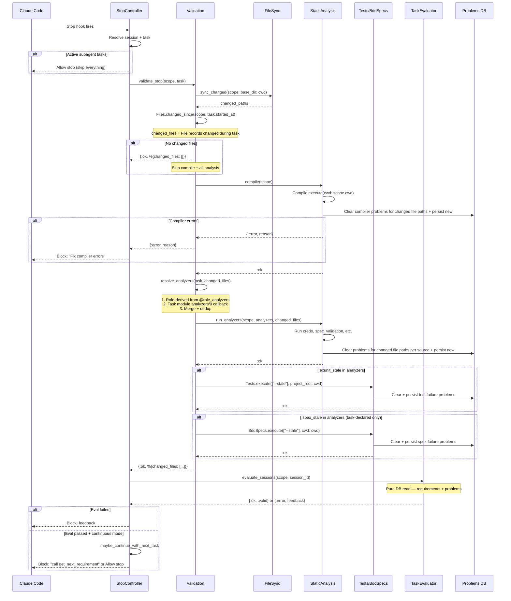

# Validation Pipeline Redesign: Task-Driven Analyzers

## Problem

The stop hook validation has smeared responsibilities. `TaskEvaluator.evaluate_stop` is a god function that syncs files, runs the analysis pipeline, and evaluates tasks. The Pipeline queries changed files internally while the StopController also queries them for logging. `FileSync.sync` (full) is used instead of `sync_changed` (incremental). `mix test --stale` and `mix spex --stale` aren't wired up at all.

Two layers need clear responsibilities:
1. **Validation** — runs analyzers, writes to DB. Does NOT decide pass/fail.
2. **Task Evaluation** — reads DB, decides pass/fail. Pure read, no side effects.

## Sequence



## Analyzer Resolution

Two sources merged:

1. **Task module `analyzers/0`** — what the task explicitly needs (e.g. ComponentCode → `[:exunit]`)
2. **Role-derived from `@role_analyzers`** — what the changed files demand (e.g. implementation file → `[:credo, :exunit_stale]`)

Both are collected and deduped. The task callback augments role-derived, not replaces.

### `@role_analyzers` map (tuning surface)

```elixir
@role_analyzers %{
  implementation: [:credo, :exunit_stale],
  test: [:credo, :exunit_stale],
  spec: [:validate_spec],
  bdd_spec: [:validate_bdd],
  qa_brief: [:validate_qa],
  qa_result: [:validate_qa],
  architecture: [],
  rule: [],
  config: [],
  review: [],
  integration: [],
  json: [],
  task_artifact: []
}
```

Note: `:spex` is NOT in the role map — BDD spec execution only runs when the task module explicitly declares it via `analyzers/0`. This avoids running slow spex checks on every stop when BDD files happen to change.

### `analyzers/0` callback on task modules

```elixir
@callback analyzers() :: [analyzer_key]
@type analyzer_key :: :credo | :sobelow | :exunit_stale | :spex_stale | :validate_spec | :validate_bdd | :validate_qa
```

| Task Module | analyzers() |
|-------------|-------------|
| ProjectSetup | `[]` |
| ComponentSpec | `[]` |
| ComponentCode | `[:exunit_stale]` |
| ComponentTest | `[:exunit_stale]` |
| WriteBddSpecs | `[:spex_stale]` |
| FixBddSpecs | `[:spex_stale]` |
| ContextSpec | `[]` |
| ContextDesignReview | `[]` |
| DevelopComponent | `[:exunit_stale]` |

Compilation always runs regardless — not in the callback, in the Validation base set.

### `--stale` for Tests and Spex

Both `mix test --stale` and `mix spex --stale` handle dependency tracking — Elixir's manifest tracks compile-time and runtime references transitively. No need to figure out which files are affected.

## Module Responsibilities

### `Validation` context (`lib/code_my_spec/validation.ex`)

The orchestrator. Owns the stop hook validation flow.

```elixir
defmodule CodeMySpec.Validation do
  @spec validate_stop(Scope.t(), task | nil, keyword()) ::
    {:ok, %{changed_files: [File.t()]}} | {:error, String.t()}
  def validate_stop(scope, task, opts \\ [])
end
```

Steps: sync_changed → changed_files → (no changes? early return) → compile via StaticAnalysis → resolve_analyzers via StaticAnalysis → run_analyzers via StaticAnalysis → run_tests → return.

### `StaticAnalysis` context (`lib/code_my_spec/static_analysis.ex`)

Public API boundary. Validation calls this, never Pipeline directly.

- `StaticAnalysis.compile(scope)` → `:ok | {:error, reason}`
- `StaticAnalysis.run_analyzers(scope, analyzers, changed_files)` → `:ok`
- `StaticAnalysis.resolve_analyzers(task, changed_files)` → `[analyzer_key]`

Delegates to Pipeline for implementation.

### `StaticAnalysis.Pipeline` (`lib/code_my_spec/static_analysis/pipeline.ex`)

Implementation module behind the StaticAnalysis context. Not called directly.

Keeps the `@role_analyzers` map and analyzer resolution logic. Loses the `run_pipeline/3` god function.

### Problem Persistence Scoping

Analyzers clear and persist problems **only for the affected file paths**, not project-wide:

- `clear_problems_for_source(scope, [source: "compiler"], changed_file_paths)` — not `:all`
- `clear_problems_for_source(scope, [source: "credo"], changed_file_paths)` — scoped
- `clear_problems_for_source(scope, [source: "exunit"], changed_file_paths)` — scoped

This preserves problems from previous runs on untouched files. Only the files that changed get their problems refreshed.

### `TaskEvaluator` (`lib/code_my_spec/validation/task_evaluator.ex`)

Pure evaluation. Reads DB, decides pass/fail.

- Remove `evaluate_stop/3` and all sync/analysis helpers
- Keep `evaluate_sessions/2`, `evaluate_session/2`, `evaluate_task/3`

### `StopController` (`lib/code_my_spec_local_web/controllers/hooks/stop_controller.ex`)

Thin HTTP layer. Resolves session/task, calls Validation, calls TaskEvaluator, decides block/allow.

### `SubagentStopController`

Same pattern, passes `agent_id` to resolve the right task.

## What Exists Today (reuse)

- `FileSync.sync_changed/2` — incremental sync (`file_sync.ex:93`)
- `Tests.execute/2` — runs `mix test` with args (`tests.ex:33`)
- `BddSpecs.execute/2` — runs `mix spex` (`bdd_specs.ex:189`)
- `ProblemConverter.from_test_failure/1` — test failures → problems
- `ProblemConverter.from_compiler/1` — compiler diagnostics → problems
- `StaticAnalysis.Runner.run/3` — run individual analyzers
- `Problems.replace_problems_for_files/3` — incremental problem persistence
- `Problems.clear_problems_for_source/3` — clear by source
- `Files.changed_since/3` — file records changed since timestamp

## Implementation Sequence

1. Refactor `Pipeline` — split `run_pipeline/3` into `compile/1` + `run_analyzers/3`
2. Rewrite `Validation` context — `validate_stop/3` as orchestrator
3. Wire `:exunit_stale` and `:spex` as analyzer types
4. Slim `TaskEvaluator` — remove `evaluate_stop/3` and helpers
5. Slim `StopController` — call Validation → TaskEvaluator → decide
6. Slim `SubagentStopController` — same pattern
7. Update `StaticAnalysis` context delegates

## Resolved Questions

- No changed files = skip everything (no compile, no analysis, no tests)
- Compiler runs when files changed (not task-declared, in Validation base set)
- Credo runs when implementation/test files change (role-derived, not base set)
- Both `mix test --stale` and `mix spex --stale` handle dependency tracking
- Spex only runs when task module declares it — not role-derived from bdd_spec files
- Task `analyzers/0` augments role-derived analyzers, not replaces
- Problem persistence is scoped to changed file paths, not project-wide
- Pipeline is fronted through StaticAnalysis context — never called directly
