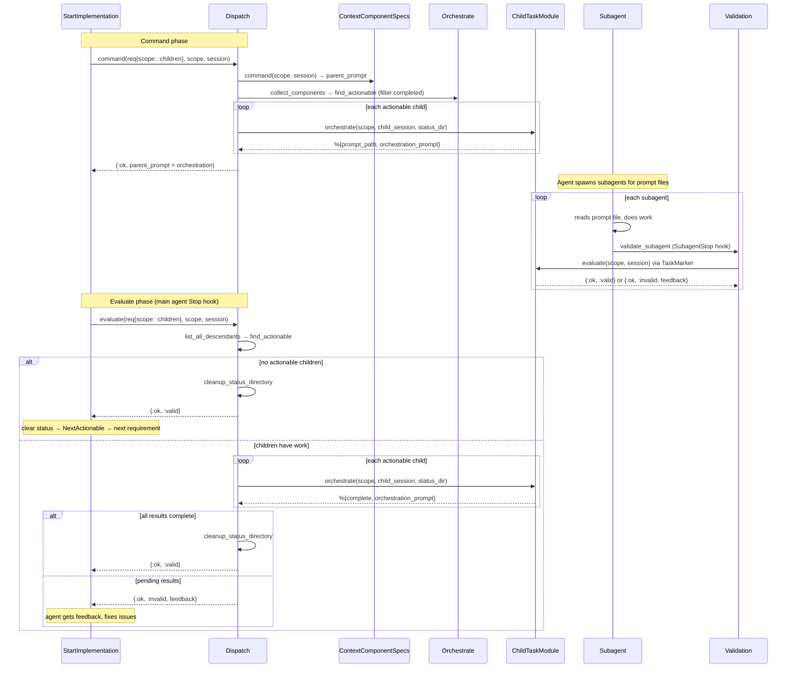

# CodeMySpec.ProjectCoordinator.Dispatch

Translates a `%Requirement{}` from NextActionable into an executable prompt (command) or a validation pass (evaluate). Thin layer — loads the entity, delegates to the task module and Orchestrate.

Scope handling:
- `:local` — load entity from FK, call `task_module.command/3` directly
- `:children` — parent `command/3` + `task_module.orchestrate/3` on each actionable (incomplete) child

## Functions

### command/3

```elixir
@spec command(Requirement.t(), Scope.t(), map()) :: {:ok, String.t()} | {:error, term()}
```

Dispatches a requirement to its task module for prompt generation.

**:local scope**: Loads the entity from the requirement's FK, builds a minimal session (`%{component: C, project: P}`), calls `req.satisfied_by.command(scope, session)`. Returns the prompt string directly.

**:children scope**: Two-phase — parent prompt + child orchestration.

1. Load context from `req.component_id`
2. Call `req.satisfied_by.command(scope, session)` → parent prompt
3. Collect context + descendants, find actionable children (filter out completed)
4. For each actionable child: call `task_module.orchestrate(scope, child_session, status_dir: dir)`
   - Writes prompt file (e.g., `.code_my_spec/status/blog/blog_post_component_spec.md`)
   - Returns `%{prompt_path, complete, orchestration_prompt}`
5. Concatenate parent prompt + orchestration checklist
6. Return `{:ok, combined_prompt}`

**Test Assertions**:

- command/3 with :local scope delegates to task module's command/3
- command/3 with :children scope returns parent prompt + orchestration for actionable children
- command/3 with :children scope filters out children with all requirements satisfied
- command/3 with :children scope returns error when no actionable children found

### evaluate/3

```elixir
@spec evaluate(Requirement.t(), Scope.t(), map()) ::
        {:ok, :valid} | {:ok, :invalid, String.t()} | {:error, term()}
```

**:local scope**: Loads entity from the requirement's FK, builds session, calls `req.satisfied_by.evaluate(scope, session)`.

**:children scope**: Dispatch handles child orchestration directly (task modules only provide `command/3`):

1. Load context from `req.component_id`, list all descendants
2. `find_actionable` on descendants (skips completed children)
3. If no actionable → `cleanup_status_directory` → `{:ok, :valid}`
4. For each actionable child: call `task_module.orchestrate(scope, child_session, status_dir: dir)`
   - Returns `%{complete, orchestration_prompt}`
5. If all results complete → `cleanup_status_directory` → `{:ok, :valid}`
6. Otherwise → `{:ok, :invalid, feedback}` with orchestration lines

**Prompt/problem file lifecycle**:
- Command phase: `orchestrate` writes prompt file
- Evaluate phase: if problems → writes `_problems.md` adjacent; if complete → deletes both
- All children done: `cleanup_status_directory` removes the whole dir

**Test Assertions**:

- evaluate/3 with :local scope delegates to task module's evaluate/3
- evaluate/3 with :children scope returns :valid when no actionable children
- evaluate/3 with :children scope returns :invalid with feedback when children have work

### build_session/3 (private)

Loads the entity referenced by the requirement's FK into a minimal session map:

- `story_id` → load story, resolve component from `story.component_id`, set `story_id`
- `component_id` → load component
- `project_id` → project from scope



## Dependencies

- `CodeMySpec.ProjectCoordinator` — collect_components, find_actionable, component_status_dir, cleanup_status_directory
- `CodeMySpec.Components` — get_component!
- `CodeMySpec.Components.ComponentRepository` — get_component, list_all_descendants
- `CodeMySpec.Stories` — get_story!
- Task modules — command/3, orchestrate/3
